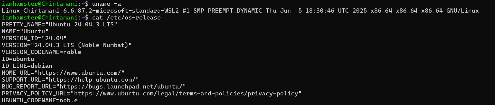
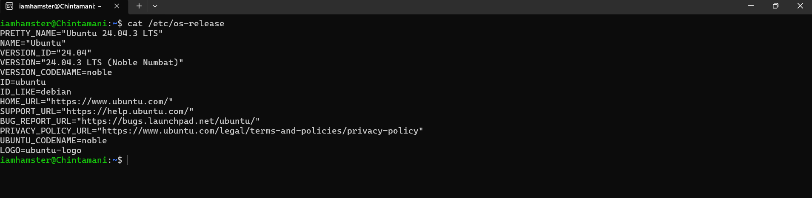
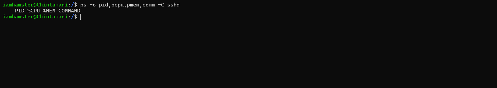
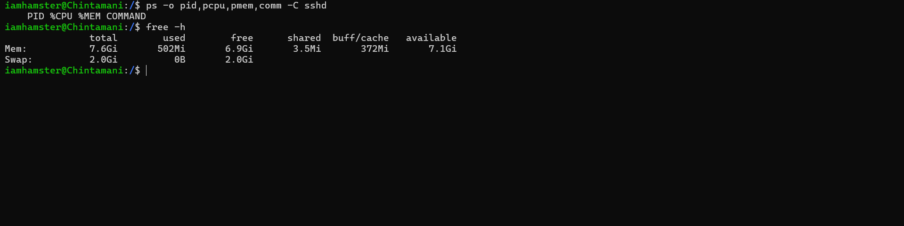
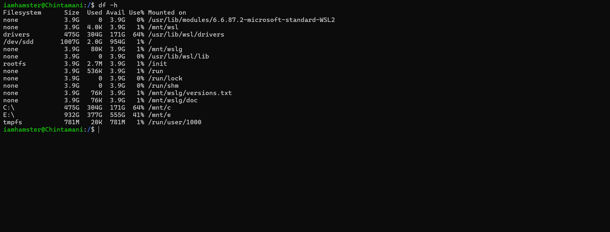
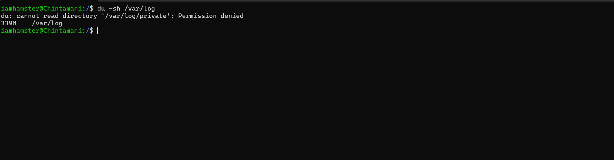
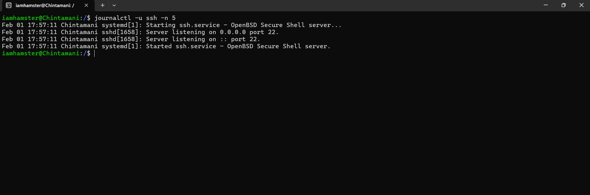
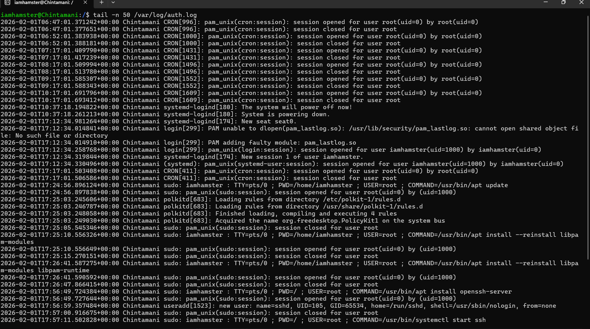

 Today is Day 5 of my 90DaysOfDevOps journey.
 
I practiced Linux troubleshooting, focusing on CPU usage, memory analysis, and log investigation, and revised some essential Linux command cheatsheets.

As a learner, I’ve realized something important:
Some people may joke about your learning progress. They don’t see your hard work because they are busy being good at something else. But that should never stop you. Stay committed to your journey, believe in your growth, and ignore negative voices. Consistency always wins.

With that mindset, I moved forward and completed today’s task with full focus and curiosity.

Let’s keep learning and growing—one day at a time
## Task
Today’s goal is to run a focused troubleshooting drill**.
Environment Basics
1. Kernel & Architecture

uname prints system information.

Command:

uname -a

2. OS Information
cat /etc/os-release

Observation:
Ubuntu-based system; LTS release suitable for production use.

Filesystem Sanity
3. Create Temporary Directory

mkdir /tmp/runbook-demo
cp /etc/hosts /tmp/runbook-demo/hosts-copy
ls -l /tmp/runbook-demo

Observation:
Filesystem is writable; directory creation successful.

Snapshot: CPU & Memory
5. SSH Process Resource Usage
ps -o pid,pcpu,pmem,comm -C sshd

Observation:
sshd is running and consuming negligible CPU and memory.

6. System Memory Status
free -h

Observation:
Sufficient free memory available; no memory pressure detected.

Snapshot: Disk & I/O
7. Disk Usage
df -h

Observation:
Root filesystem usage is within safe limits.

8. Log Directory Size
du -sh /var/log

Observation:
Log size is reasonable; no immediate disk risk.

Snapshot: Network
9. SSH Port Listening
ss -tulpn | grep ssh

Observation:
SSH daemon is listening on port 22 as expected.

10. Network Stack Test
curl -I http://localhost

Observation:
Local network stack responding correctly.

11. Logs Reviewed

Check service logs via journalctl

Command:

journalctl -u ssh -n 5
journalctl is a systemd log viewer.
-u ssh filters logs only for the SSH service.
-n 5 shows the last 5 log entries.

This command is used to quickly check recent SSH service logs to identify:

startup failures
crashes
authentication errors
configuration issues
This helps confirm whether the service itself is failing or behaving normally.

12. Inspect application logs (tail)

Command:

tail -n 50 /var/log/auth.log

