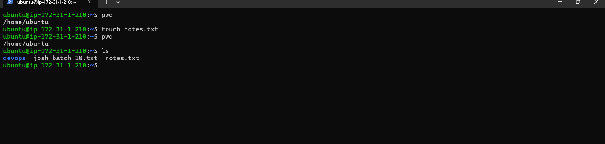
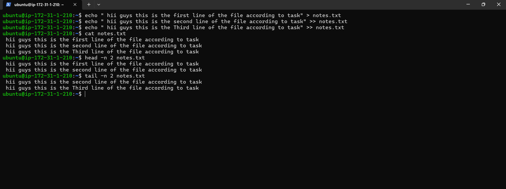
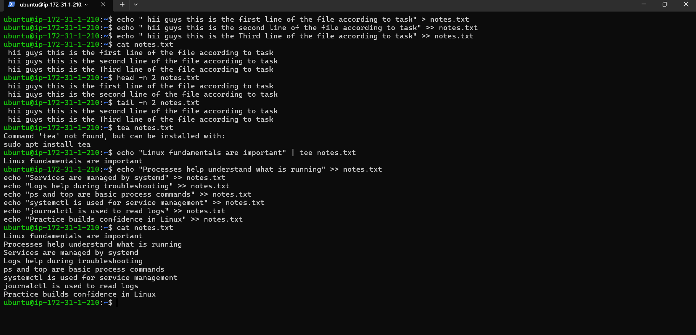

# Day 06 – Linux Fundamentals: Read and Write Text Files

This is a continuation of Day 05, but much simpler.
This post is only for continueing of challenge so if you want to read you can spen your time here otherwise you can skip this.

Today’s goal is to practice basic file read/write using only fundamental commands.Challange

Creating a file
Writing text to a file
Appending new lines
Reading the file back

 
 # Practicing Linux file operations today as part of my hands-on learning:

Writing multiple lines into a file using output redirection (> and >>)

Reading the complete file using cat

Viewing specific parts of the file using head and tail

Using tee to write to a file while displaying output at the same time

Keeping the file concise with 8–12 lines for clarity and practice

Continuing to build strong Linux fundamentals through consistent, hands-on practice.

So this is the End of the day 06 of 90 days of DevOps challenge. i hope you guys also doing great in your life