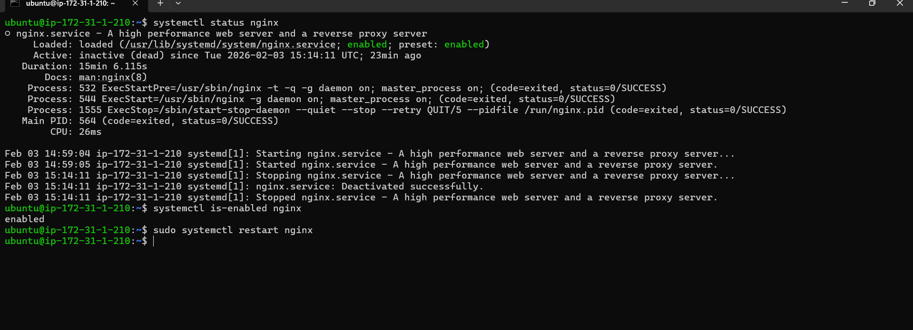
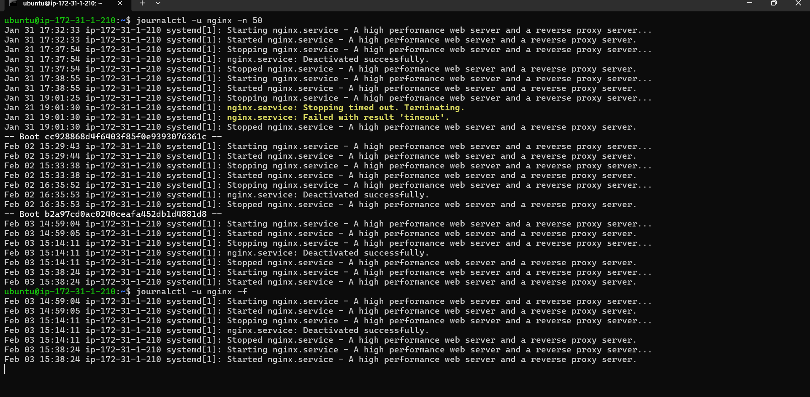
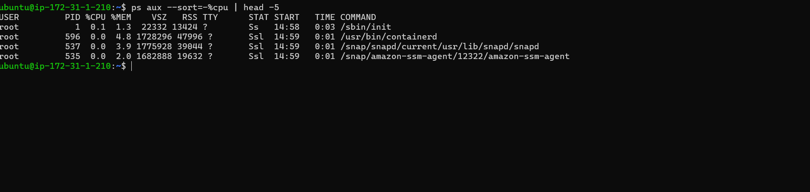
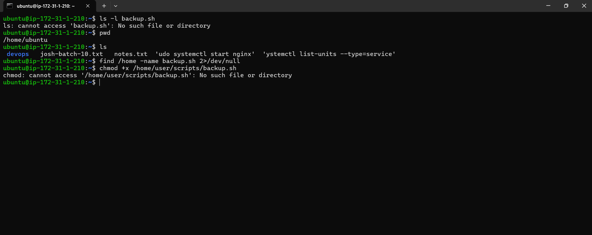

Day 07 – Linux Troubleshooting (Scenario-Based Practice)
Objective

The goal of Day 07 was to practice real Linux troubleshooting and learn how to solve problems step by step instead of memorizing commands.

Topics Covered
1. Service Troubleshooting

Checked whether a service is running, stopped, or failed.

Command examples:

systemctl status nginx
systemctl is-enabled nginx
sudo systemctl restart nginx

What I learned:
Always check service status first before trying to fix anything.

2. Log Analysis (systemd)

Learned how to find and read logs for systemd-managed services.

Command examples:

journalctl -u nginx -n 50
journalctl -u nginx -f

What I learned:
Logs explain why something failed. Reading logs saves time.

3. High CPU Usage Investigation

Identified processes that are using high CPU.

Command examples:

top
ps aux --sort=-%cpu | head -10
ps -p <PID> -o pid,cmd,%cpu,%mem

What I learned:
High CPU usage is a sign of a problem, not the actual problem.

4. File Permission Issues

Fixed script execution issues caused by missing permissions.

Command examples:

ls -l backup.sh
chmod +x backup.sh
./backup.sh

What I learned:
Without execute permission, scripts will not run.

Key Learning

Troubleshooting follows a clear flow:

Observe the system state

Read logs and command output

Identify the root cause

Apply a controlled fix

Verify the solution

Takeaway

Day 07 helped me understand how DevOps engineers troubleshoot real issues.
Instead of guessing, I learned to stay calm, read logs, check service status, and fix problems step by step using hands-on practice.