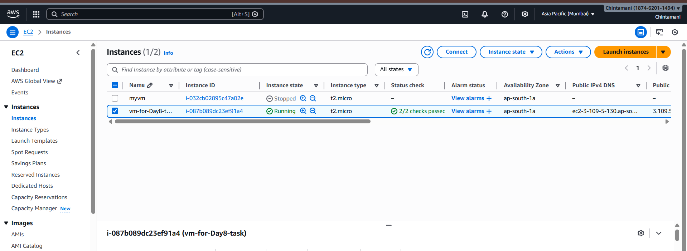
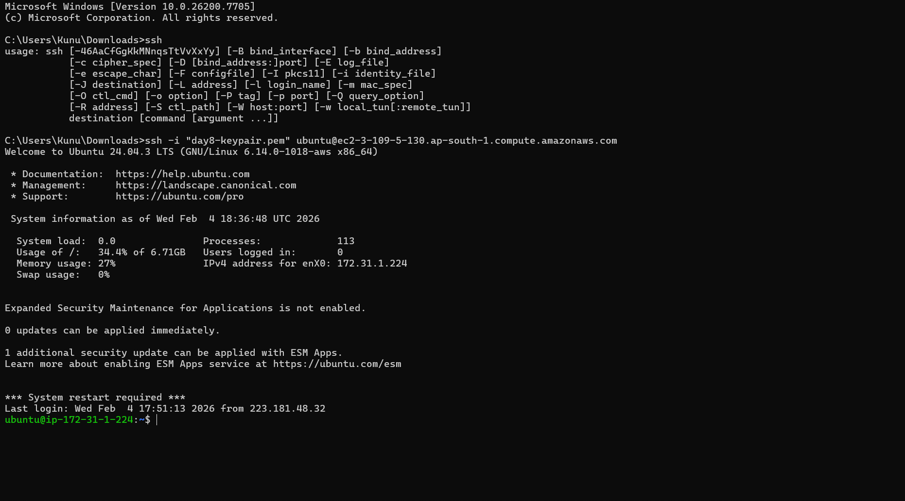
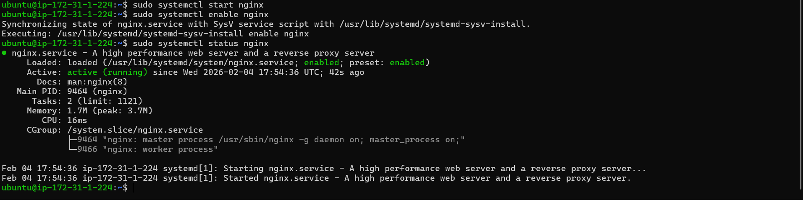
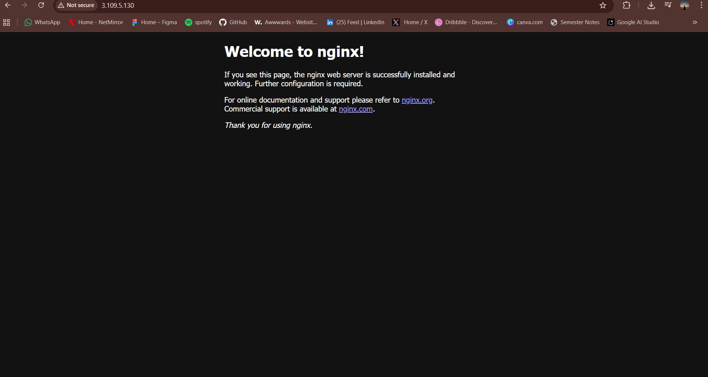
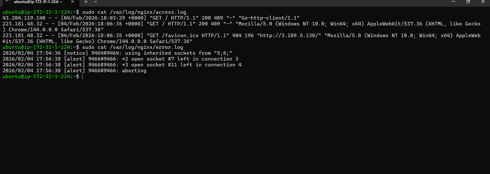

# Day 08 – Cloud Server Setup: Docker, Nginx & Web Deployment

## Objective
The objective of Day 08 is to deploy a real web server on a cloud virtual machine and practice hands-on server management tasks commonly performed in production environments.

This task focuses on cloud provisioning, secure remote access, service deployment, log management, and public accessibility verification.

---

## Environment Details
- Cloud Provider: AWS EC2 
- Operating System: Ubuntu 22.04 LTS
- Web Server: Nginx
- Container Runtime: Docker
- Access Method: SSH
- Local Machine: Linux / Windows (SSH + SCP)

---

## Part 1: Launch Cloud Instance and SSH Access

### Step 1: Cloud Instance Creation
- Created an EC2 instance using Ubuntu AMI
- Selected instance type: t2.micro
- Generated and downloaded PEM key pair
- Configured security group:
  - SSH (22): Allowed from my IP
  - HTTP (80): Allowed from anywhere (0.0.0.0/0)


### Step 2: SSH Connection
```bash
chmod 400 your-key.pem
ssh -i your-key.pem ubuntu@<public-ip>

Part 2: Install Docker and Nginx


sudo apt update && sudo apt upgrade -y
sudo apt install nginx -y
sudo systemctl start nginx
sudo systemctl enable nginx



sudo apt install docker.io -y
sudo systemctl start docker
sudo systemctl enable docker


Part 3: Security Group Configuration 


Part 4: Extract Nginx Logs

Step 1: View Logs
sudo cat /var/log/nginx/access.log
sudo cat /var/log/nginx/error.log

Step 2: Save Logs to File
sudo cat /var/log/nginx/access.log > nginx-logs.txt

Step 3: Download Logs to Local Machine
scp -i your-key.pem ubuntu@<public-ip>:~/nginx-logs.txt .


Commands Used

ssh
apt update
apt upgrade
apt install docker.io
apt install nginx
systemctl start
systemctl enable
systemctl status
cat
chmod

Challenges Faced
Initial web access failure due to missing HTTP rule in the security group.
Resolved by allowing inbound traffic on port 80.
Faced permission issues while copying logs, resolved by storing logs in the home directory.

What I Learned

Cloud VM provisioning and secure SSH access
Installing and managing services on Linux servers
Configuring security groups for public access
Extracting and transferring server logs


Why This Matters for DevOps

This exercise demonstrates real DevOps responsibilities:
Cloud infrastructure provisioning
Secure remote server management
Application and service deployment
Log monitoring and troubleshooting
Network and security configuration