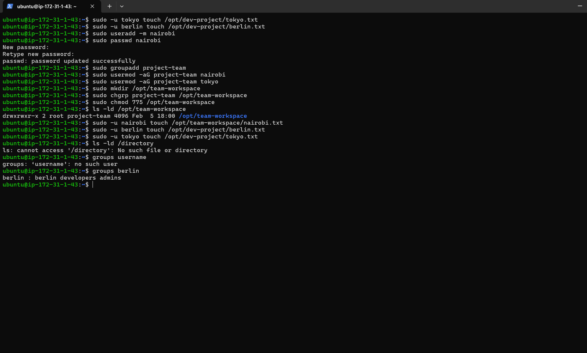

# Day 09 – Linux User & Group Management Challenge

## Users & Groups Created

### Users
- tokyo
- berlin
- professor
- nairobi

### Groups
- developers
- admins
- project-team

---

## Task 1: Create Users

Creating users manually helped reinforce how Linux treats every user as an independent identity with its own environment and permissions.

```bash
sudo useradd -m tokyo
sudo useradd -m berlin
sudo useradd -m professor

sudo passwd tokyo
sudo passwd berlin
sudo passwd professor

```

 ## Task 2: Create Groups
```bash
This step made it clear why group-based access control scales better than managing permissions user by user.

sudo groupadd developers
sudo groupadd admins
```

## Task 3: Assign to Groups
```bash
Assigning users to multiple groups highlighted how flexible Linux permission management can be when designed correctly.

sudo usermod -aG developers tokyo
sudo usermod -aG developers,admins berlin
sudo usermod -aG admins professor
```

## Task 4: Shared Directory
```bash
Configuring a shared directory showed how small permission changes can directly affect team productivity and access control.

sudo mkdir /opt/dev-project
sudo chgrp developers /opt/dev-project
sudo chmod 775 /opt/dev-project
```

## Task 5: Team Workspace
```bash
sudo -u tokyo touch /opt/dev-project/tokyo.txt
sudo -u berlin touch /opt/dev-project/berlin.txt
```
 ## Task 5: Team Workspace
```bash
Testing access as another user made the permission model feel practical rather than theoretical.

sudo useradd -m nairobi
sudo passwd nairobi

sudo groupadd project-team
sudo usermod -aG project-team nairobi
sudo usermod -aG project-team tokyo

sudo mkdir /opt/team-workspace
sudo chgrp project-team /opt/team-workspace
sudo chmod 775 /opt/team-workspace
```
```bash

Verification:

groups nairobi
groups tokyo
ls -ld /opt/team-workspace

```
```bash
Access test:

sudo -u nairobi touch /opt/team-workspace/nairobi.txt
```
## Here all the screenshots for verification 



