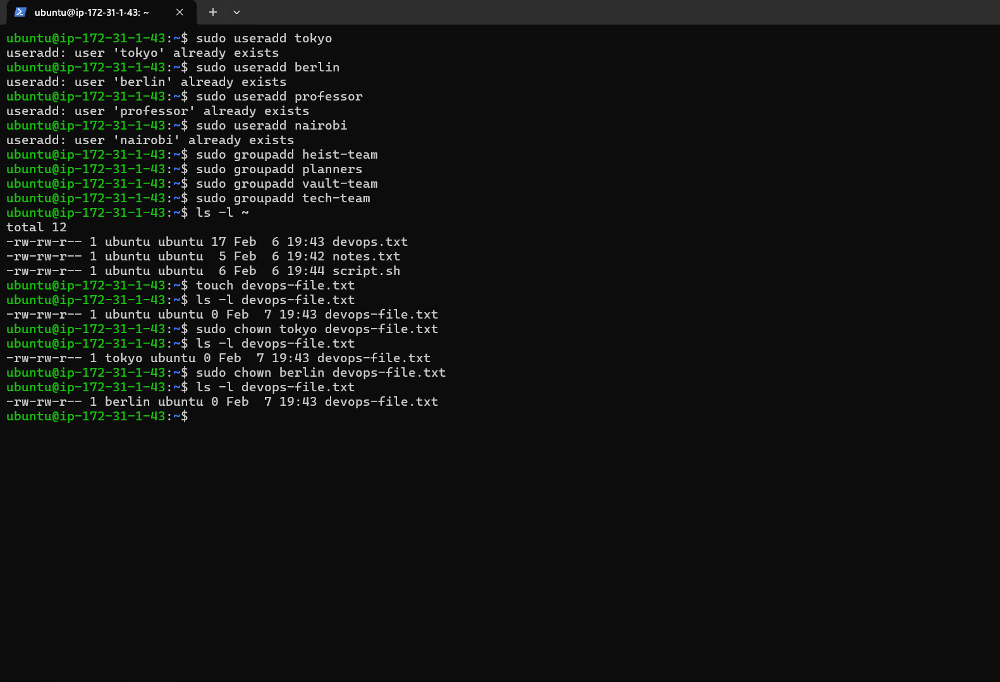
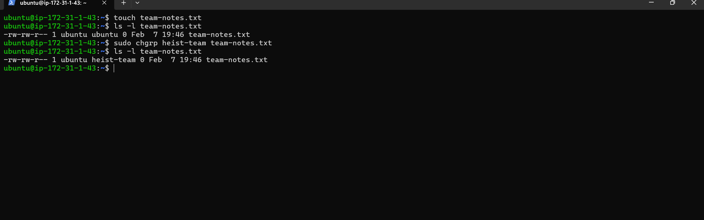
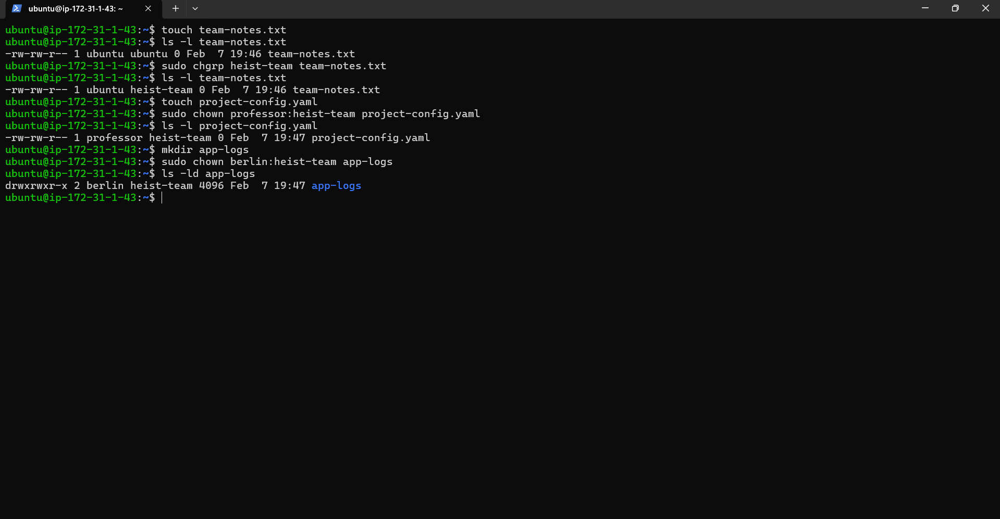
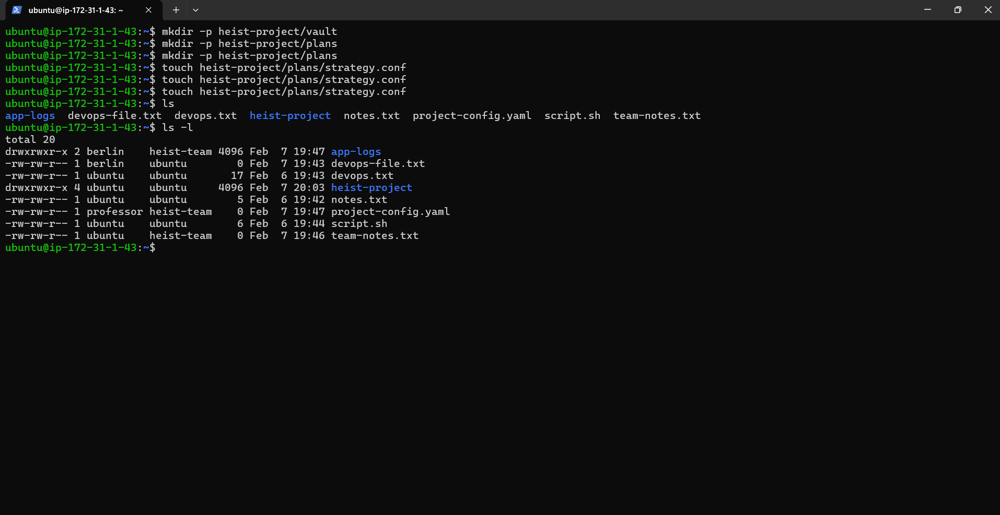
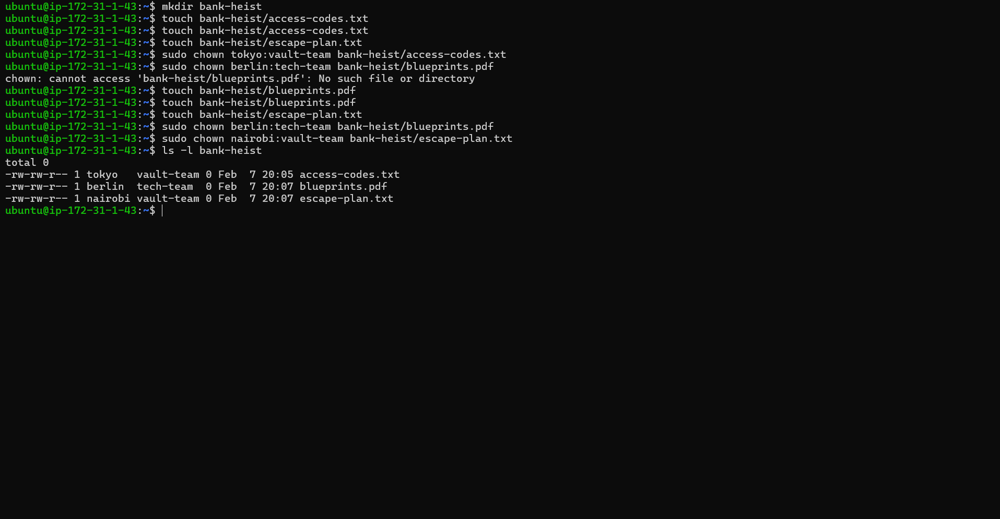

### Day 11 – File Ownership Challenge (chown & chgrp)

This challenge matters because correct file ownership is essential for secure application deployments, multi-user environments, CI/CD pipelines, and preventing permission-related failures in production systems.

# PART 0: One-time setup (users & groups)

Here are the command i used while creating these files 
```bash
sudo useradd tokyo
sudo useradd berlin
sudo useradd professor
sudo useradd nairobi
```
```bash
sudo groupadd heist-team
sudo groupadd planners
sudo groupadd vault-team
sudo groupadd tech-team
```

# TASK 1: Understanding Ownership
```bash
ls -l ~
```
--documentation of commands

Owner: The user who owns the file

Group: A group of users with shared permissions

Format:
```bash
-rw-r--r-- 1 owner group size date filename
```
# TASK 2: Basic chown Operations
```bash
touch devops-file.txt
ls -l devops-file.txt
```
```bash
sudo chown tokyo devops-file.txt
ls -l devops-file.txt
``` 
```bash
sudo chown berlin devops-file.txt
ls -l devops-file.txt
```
```bash
sudo chown professor devops-file.txt
ls -l devops-file.txt
```
Here is the Screenshot 


# TASK 3: Basic chgrp Operations
```bash
touch team-notes.txt
ls -l team-notes.txt
```
```bash
sudo chgrp heist-team team-notes.txt
ls -l team-notes.txt
```
```bash
sudo groupadd heist-team
sudo chgrp heist-team team-notes.txt
ls -l team-notes.txt
```

# TASK 4: Combined Owner & Group Change
```bash
touch project-config.yaml
sudo chown professor:heist-team project-config.yaml
ls -l project-config.yaml
```
```bash
mkdir app-logs
sudo chown berlin:heist-team app-logs
ls -ld app-logs
```
Here is the screenshot


# TASK 5: Recursive Ownership
```bash
mkdir -p heist-project/vault
mkdir -p heist-project/plans
```
```bash
touch heist-project/vault/gold.txt
touch heist-project/plans/strategy.conf
```
```bash
sudo groupadd planners
sudo chown -R professor:planners heist-project
ls -lR heist-project
```

# TASK 6: Practice Challenge
```bash
mkdir bank-heist
```
```bash
touch bank-heist/access-codes.txt
touch bank-heist/blueprints.pdf
touch bank-heist/escape-plan.txt
```
```bash
sudo chown tokyo:vault-team bank-heist/access-codes.txt
sudo chown berlin:tech-team bank-heist/blueprints.pdf
sudo chown nairobi:vault-team bank-heist/escape-plan.txt
```
```bash
ls -l bank-heist
```



## Thanks for Reading This