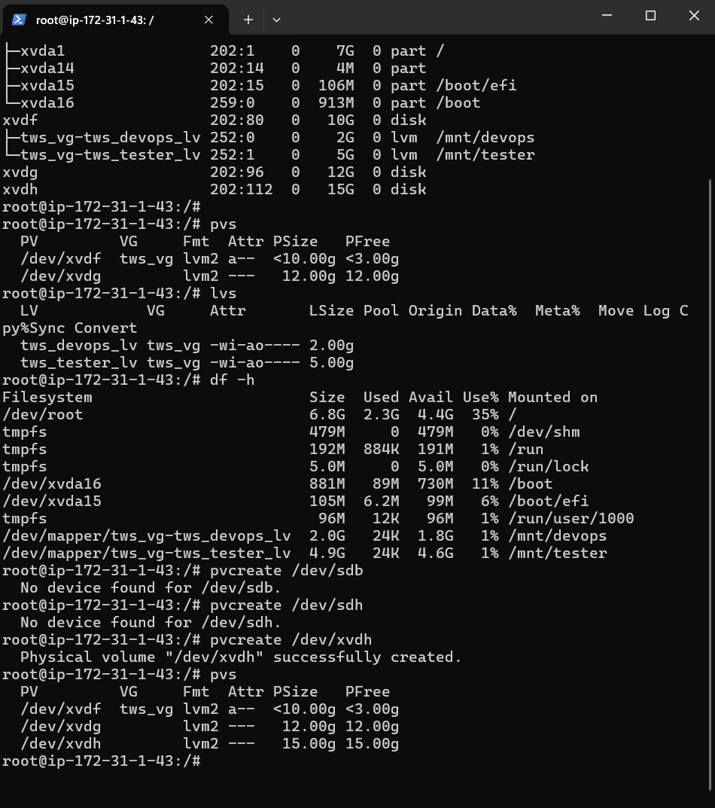
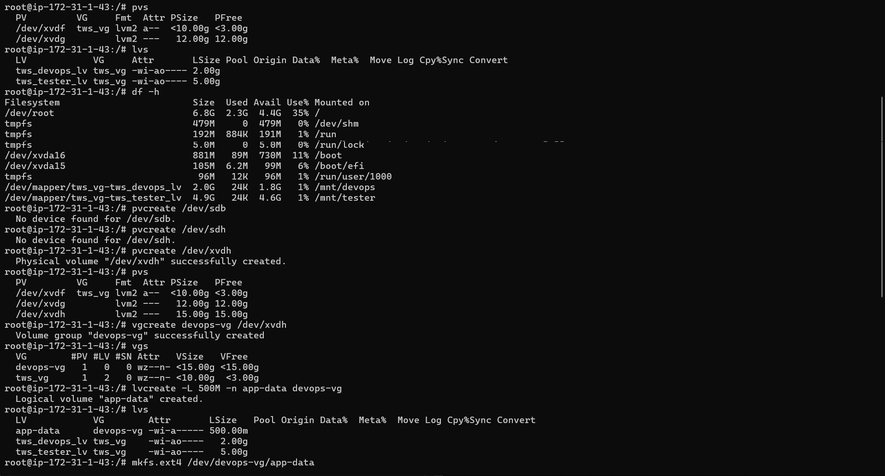
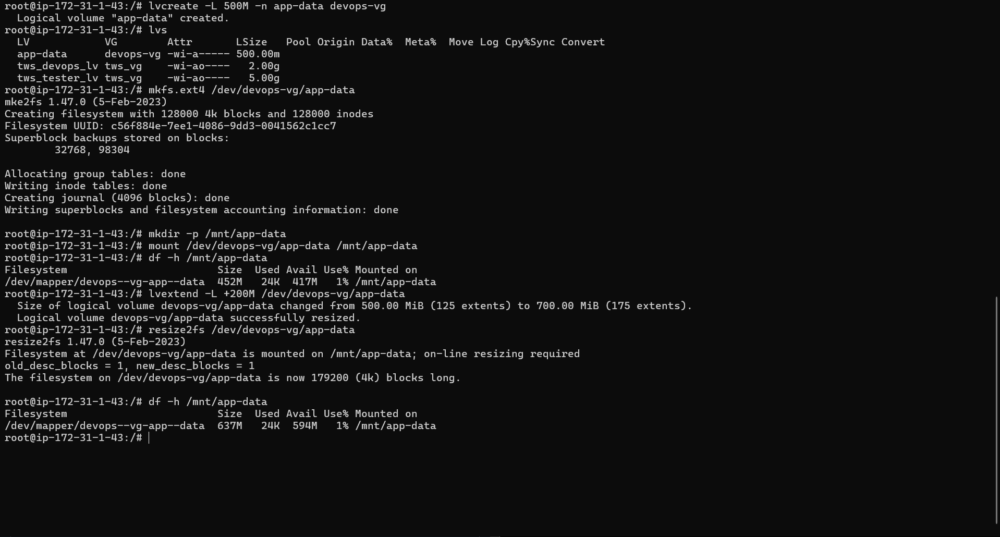

# Day 13 – Linux Volume Management (LVM)

## Objective
Day 13 was focused on understanding **Linux Volume Management (LVM)** and how storage can be managed flexibly in real systems.  
The idea was to learn how disks are created, grouped, mounted, and extended without interrupting running applications.

---

## Setup
Since I did not have an extra physical disk, I created a virtual disk using a loop device for practice.

Checking Existing Storage

Before starting, I checked the current storage state to understand what already existed.
```bash
lsblk
pvs
vgs
lvs
df -h

```
This confirmed that no physical volumes or volume groups were present initially.
Creating the Physical Volume

The loop device was initialized as a Physical Volume.
```bash
pvcreate /dev/loop0
pvs
```

At this stage, the disk became ready to be used by LVM.

Creating the Volume Group

Next, I created a Volume Group to combine storage under one logical name.
```bash
vgcreate devops-vg /dev/loop0
vgs
```

The volume group acts as a storage pool for logical volumes.

Creating the Logical Volume

From the volume group, I created a Logical Volume to store application data.
```bash
lvcreate -L 500M -n app-data devops-vg
lvs
```

This logical volume behaves like a regular disk partition.

Formatting and Mounting

The logical volume was formatted and mounted so it could be used.
```bash
mkfs.ext4 /dev/devops-vg/app-data
mkdir -p /mnt/app-data
mount /dev/devops-vg/app-data /mnt/app-data
df -h /mnt/app-data
```

At this point, the storage was live and usable.

Extending the Logical Volume

To understand LVM’s real power, I extended the logical volume and resized the filesystem without unmounting it.
```bash
lvextend -L +200M /dev/devops-vg/app-data
resize2fs /dev/devops-vg/app-data
df -h /mnt/app-data
```

The size increased successfully with no downtime.

---

## Documentation
Here are  the Screenshots for Reference
 

