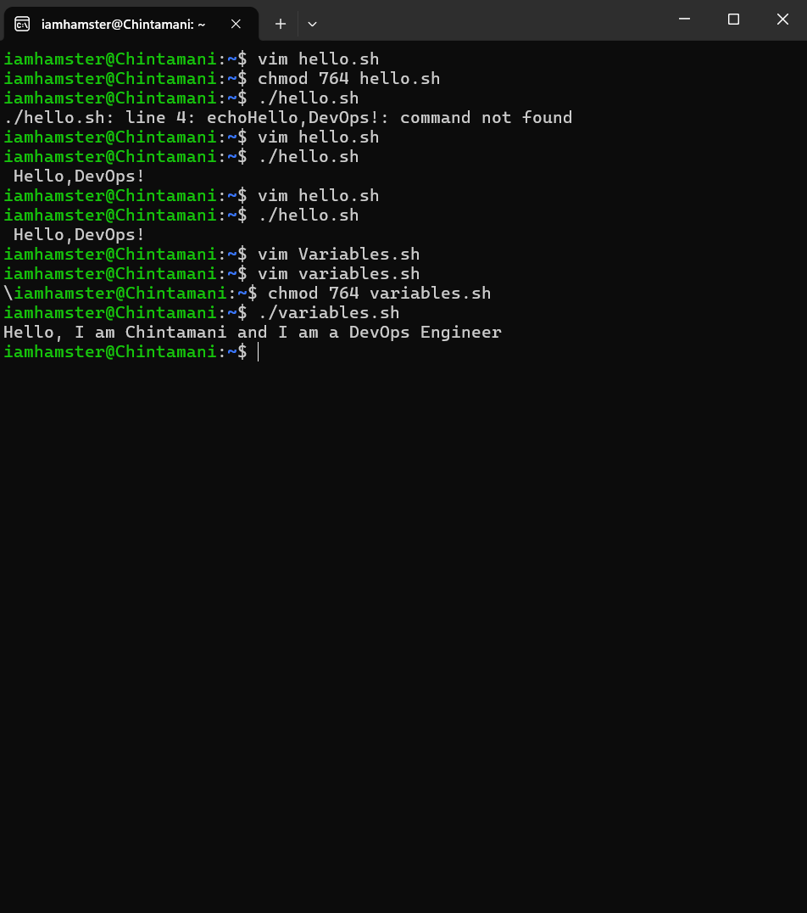
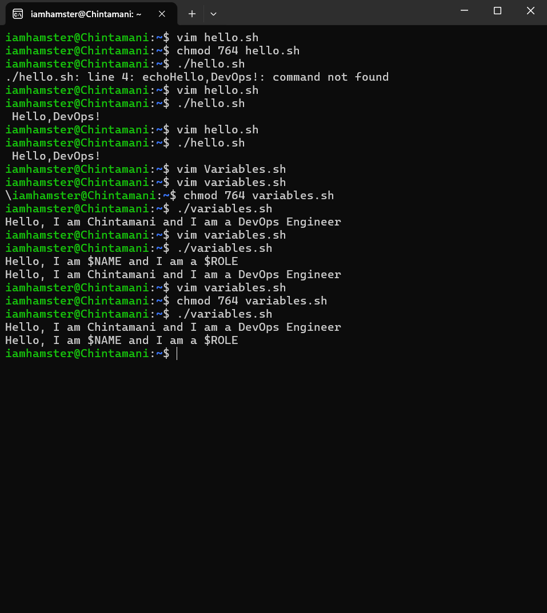
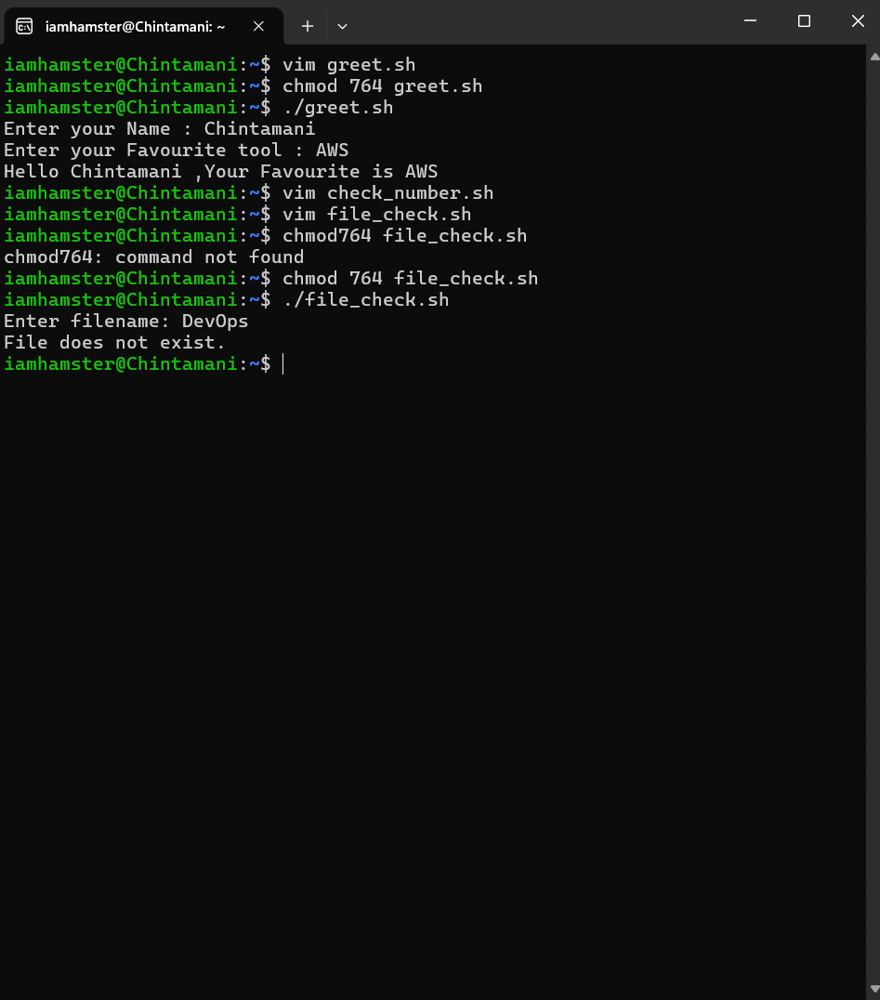
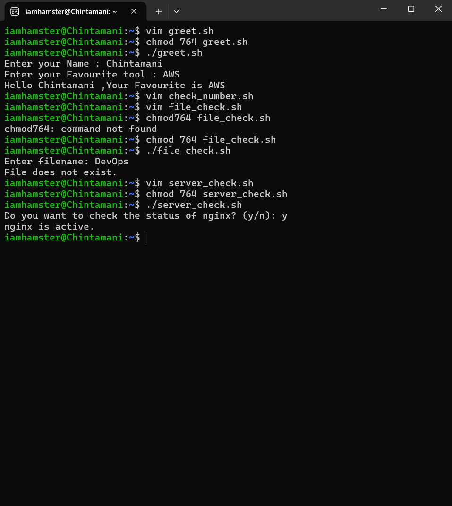

# Day 16 – Shell Scripting Basics

## Objective
Day 16 focused on learning the core building blocks of shell scripting:
- Shebang usage
- Variables
- User input
- If-else conditions

---

## Scripts Created

### 1. hello.sh
Prints a simple message using echo.

Learned how shebang defines interpreter.

If shebang is removed:
- Script may run with default shell
- Bash-specific features may break

✔ Shebang ensures the correct interpreter runs the script.
### 2. variables.sh
Demonstrates variable declaration and difference between single and double quotes.
Understood:
- How to declare variables
- Difference between single and double quotes

Double quotes expand variables.
Single quotes print literally.
| Quotes | Behavior          |
| ------ | ----------------- |
| " "    | Expands variables |
| ' '    | Prints literally  |

### 3. greet.sh
Used `read` to accept user input.
Learned how to dynamically build output.
Takes user input using read and prints dynamic output.

### 4. check_number.sh
Uses if-elif-else to classify a number as positive, negative, or zero.

### 5. file_check.sh
Used:
- `-gt`, `-lt` for numeric comparison
- `-f` for file checking

Checks if a file exists using -f condition.

### 6. server_check.sh
Checks whether a service is active using systemctl.

Combined:
- Variables
- read
- if-else
- systemctl
- exit status checking
---

## Key Learnings

1. Shebang ensures correct shell interpreter.
2. Double quotes allow variable expansion; single quotes do not.
3. Conditional logic allows automation and decision making.
4. Shell scripting forms the foundation of DevOps automation.
