# Day 17 – Shell Scripting: Loops, Arguments & Error Handling

Today’s focus was on writing and understanding shell scripts that use loops, handle command-line arguments, and include basic error handling. These are essential skills for automating DevOps workflows and writing reliable scripts that can run in various environments.

---

## Scripts and Outputs

### 1. for_loop.sh

**Code:**
```bash
#!/bin/bash
fruits=("Apple" "Banana" "Mango" "Orange" "Grapes")

for fruit in "${fruits[@]}"; do
  echo "$fruit"
done
```
**Output:**
```bash
Apple
Banana
Mango
Orange
Grapes
```

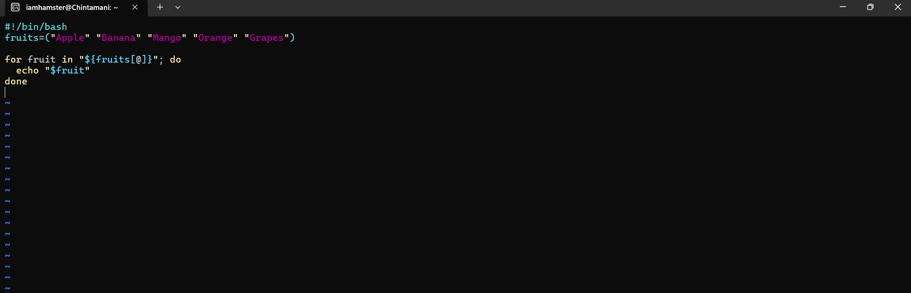

2. count.sh

Code:
```bash
#!/bin/bash
for i in {1..10}; do
  echo "$i"
done
```

```bash
Output:

1
2
3
```
...
10
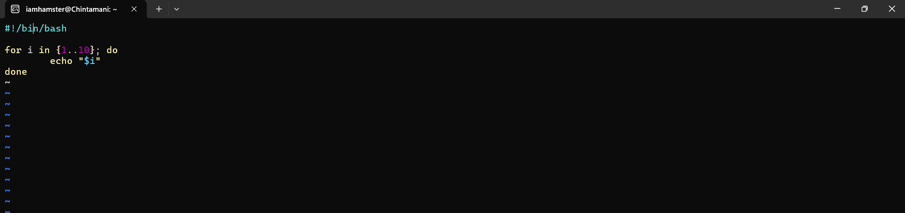
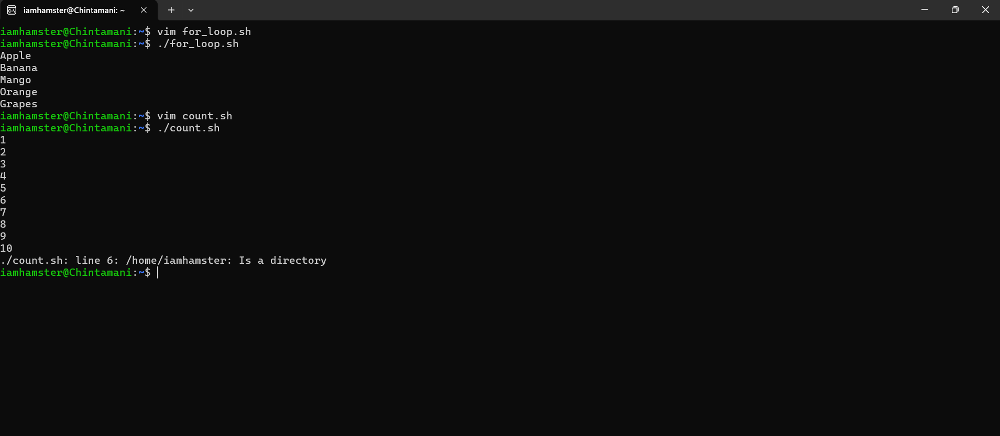

3. countdown.sh

Code:
```bash         
#!/bin/bash
read -p "Enter a number to start countdown: " num

while [ $num -ge 0 ]; do
  echo "$num"
  ((num--))
done

echo "Done!"

```
Sample Run:
```bash
$ ./countdown.sh
Enter a number to start countdown: 5
5
4
3
2
1
0
Done!
```
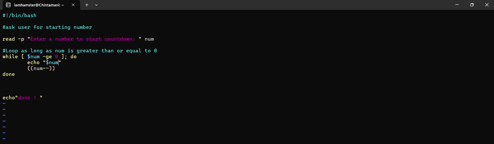
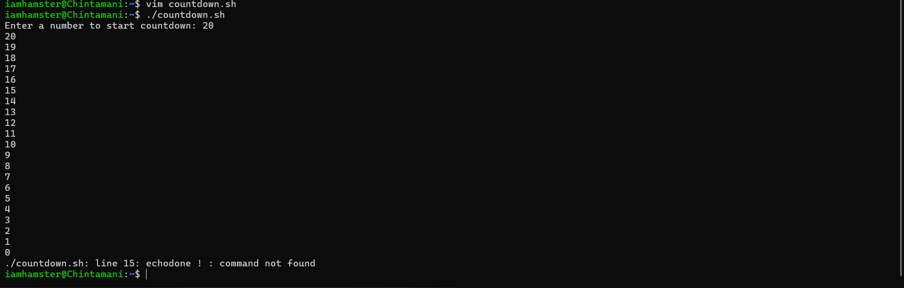

4. greet.sh
```bash
Code:

#!/bin/bash

if [ $# -eq 0 ]; then
  echo "Usage: ./greet.sh <name>"
else
  echo "Hello, $1!"
fi

```
Sample Output:

./greet.sh John → Hello, John!
./greet.sh      → Usage: ./greet.sh <name>
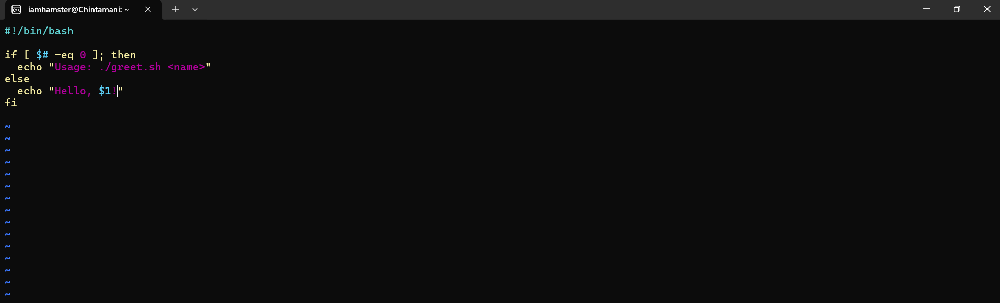
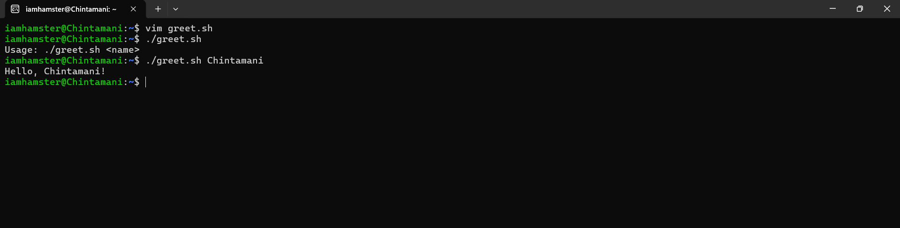

5. args_demo.sh
```bash
Code:

#!/bin/bash

echo "Total arguments: $#"
echo "All arguments: $@"
echo "Script name: $0"

```
Sample Output:
```bash
$ ./args_demo.sh file1 file2 file3
Total arguments: 3
All arguments: file1 file2 file3
Script name: ./args_demo.sh!
```
[alt text](image-10.png)
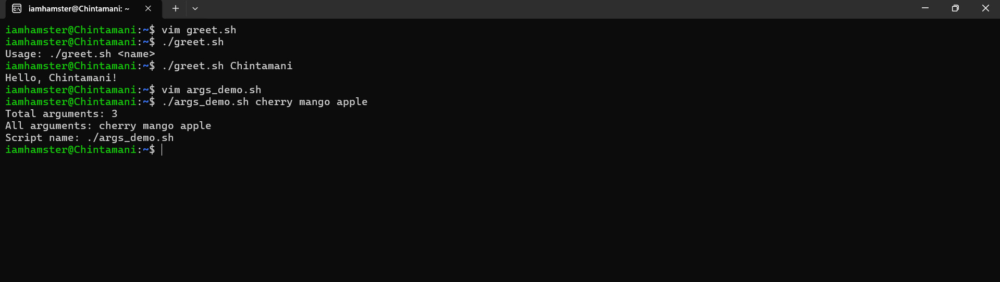

6. install_packages.sh
```bash
Code:

#!/bin/bash

if [ "$EUID" -ne 0 ]; then
  echo "Please run this script using sudo"
  exit 1
fi

packages=("nginx" "curl" "wget")

for pkg in "${packages[@]}"; do
  echo "Checking $pkg..."
  dpkg -s "$pkg" &> /dev/null
  if [ $? -eq 0 ]; then
    echo "$pkg is already installed"
  else
    echo "Installing $pkg..."
    apt install -y "$pkg"
  fi
done
```

Sample Output:
```bash
$ ./install_packages.sh
Checking nginx...
nginx is already installed
Checking curl...
Installing curl...
Checking wget...
wget is already installed
```
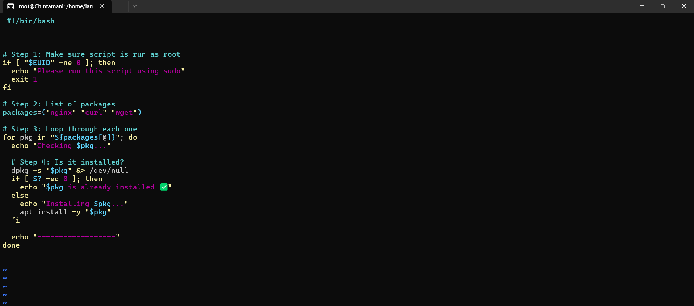
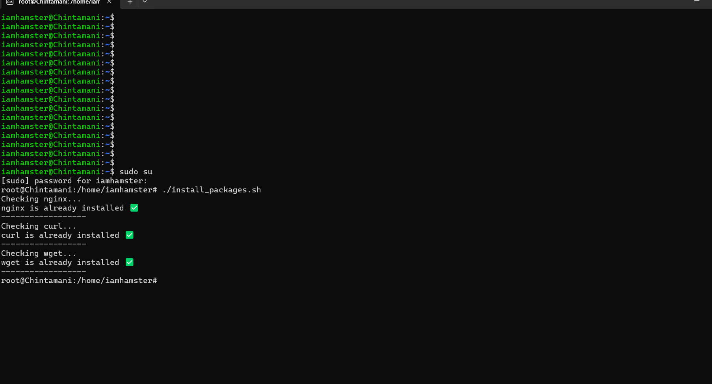
7. safe_script.sh
```bash
Code:

#!/bin/bash

set -e

mkdir /tmp/devops-test || echo "Directory already exists"
cd /tmp/devops-test || echo "Cannot change directory"
touch hello.txt || echo "Failed to create file"

echo "Done"

```
Sample Output:
```bash
$ ./safe_script.sh
Directory already exists
Done
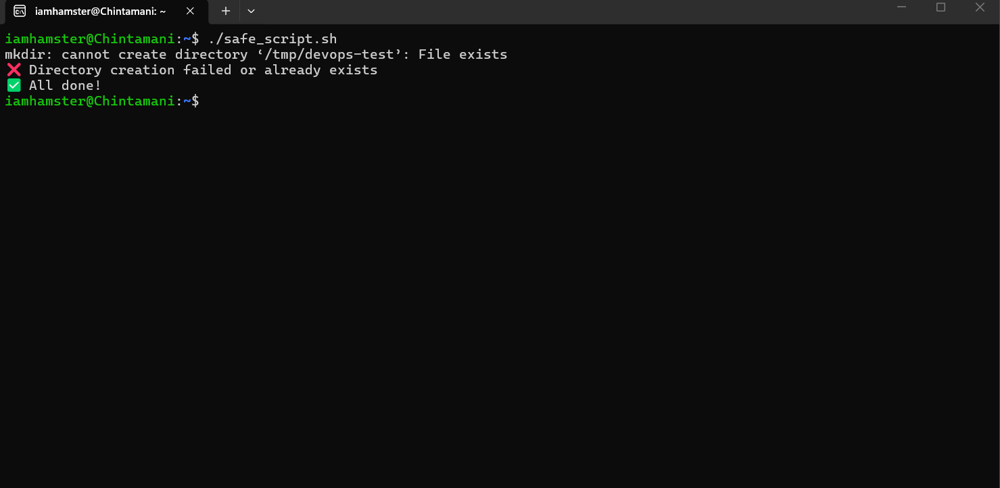


```