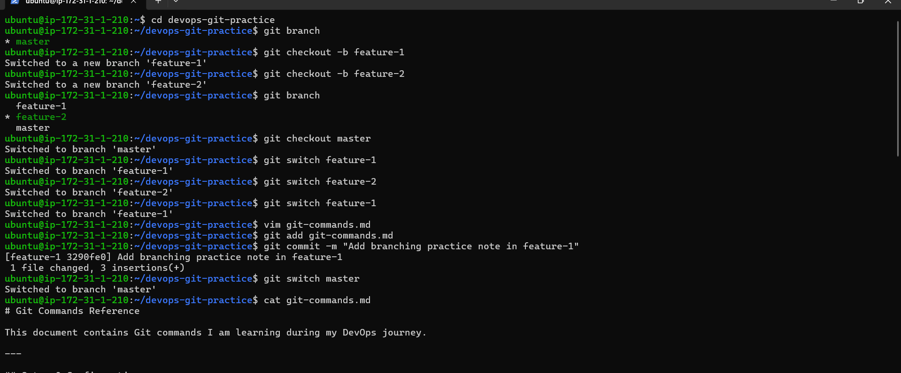
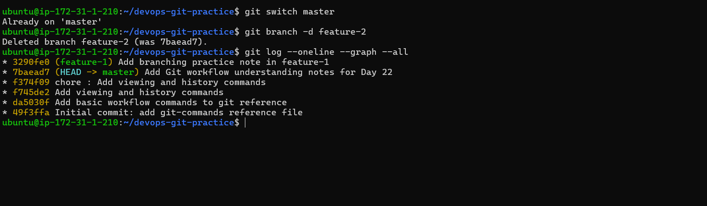
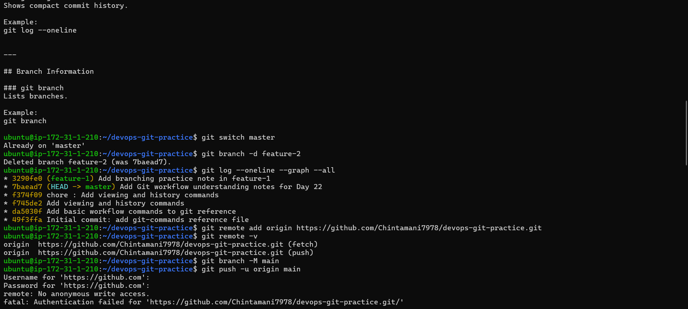
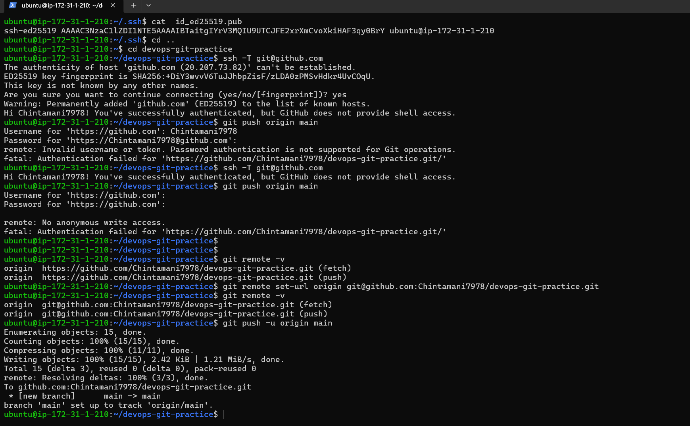
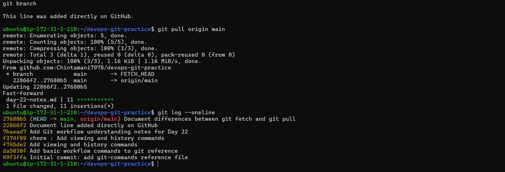

# Day 23 – Git Branching & Working with GitHub

Overview

Today I focused on understanding Git branching and working with GitHub remotes.
Branching is one of the most powerful features in Git, allowing safe and structured development without affecting stable code.

This exercise included hands-on practice with branch creation, switching, deleting, pushing to GitHub, pulling changes, and understanding clone vs fork.

Task 1 – Understanding Branches
# 1. What is a branch in Git?

A branch in Git is a movable pointer to a commit.
It allows independent development within the same repository.

Each branch can have its own commit history without interfering with others.

# 2. Why do we use branches instead of committing everything to main?

Branches allow:

Safe feature development

Bug fixes without breaking stable code

Experimentation

Cleaner and more organized version history

The main branch should remain stable and production-ready.

# 3. What is HEAD in Git?

HEAD is a pointer to the current active branch and its latest commit.

When switching branches, HEAD moves accordingly.

# 4. What happens when switching branches?

When switching branches:

Git updates the working directory to match the selected branch.

Files may change based on commits in that branch.

Uncommitted changes may block switching.

# Task 2 – Branching Commands — Hands-On

git branch
git branch feature-1
git switch feature-1
git switch -c feature-2
git checkout main
git branch -d feature-2
git log --oneline --graph --all

