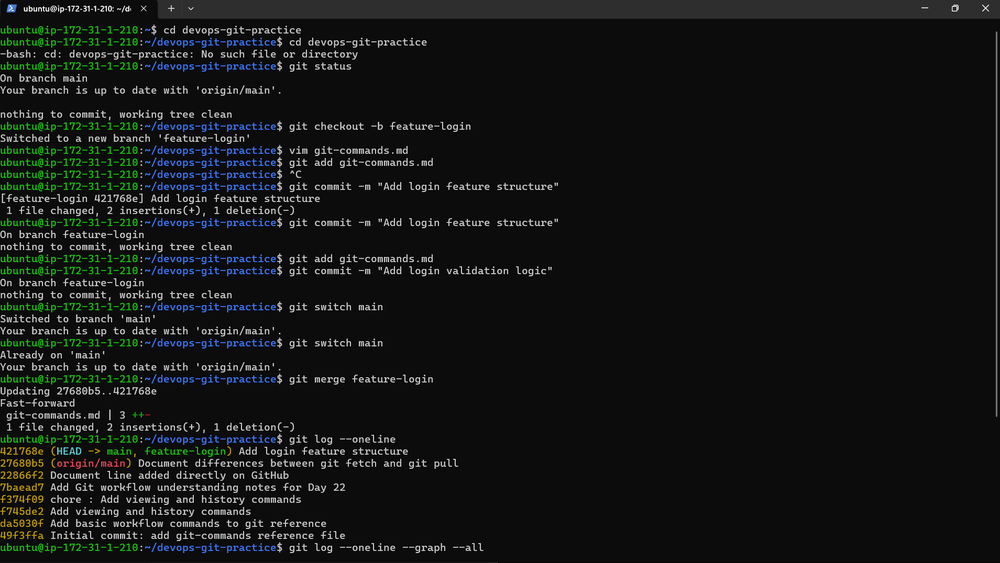
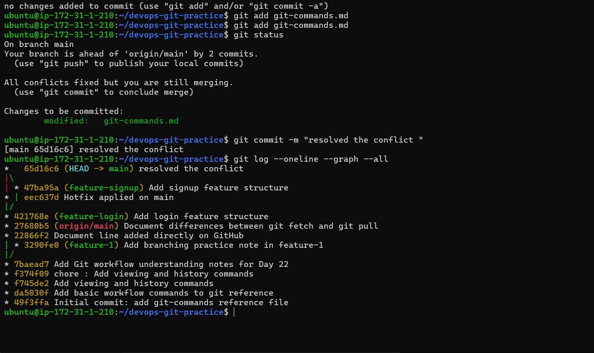
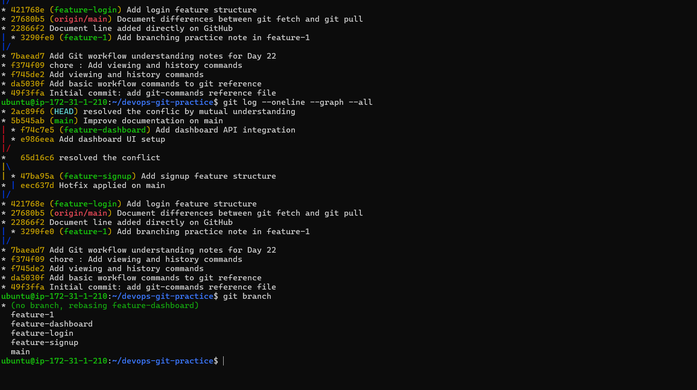
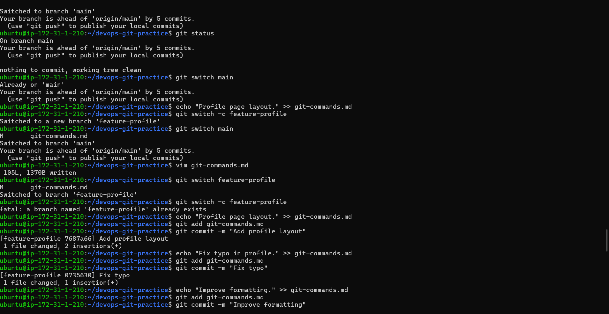
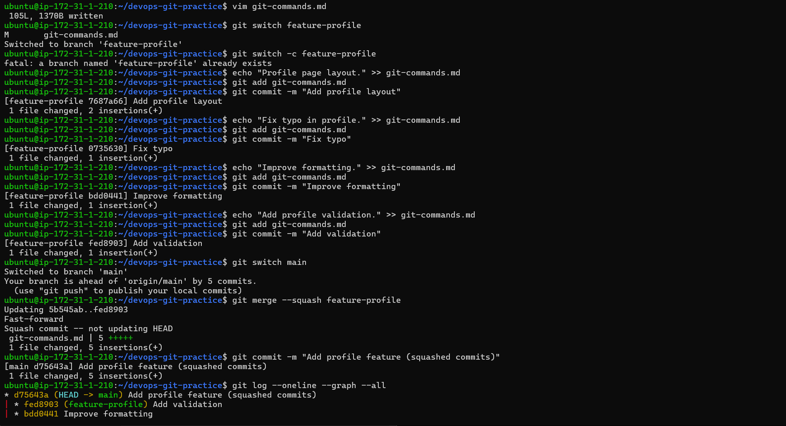
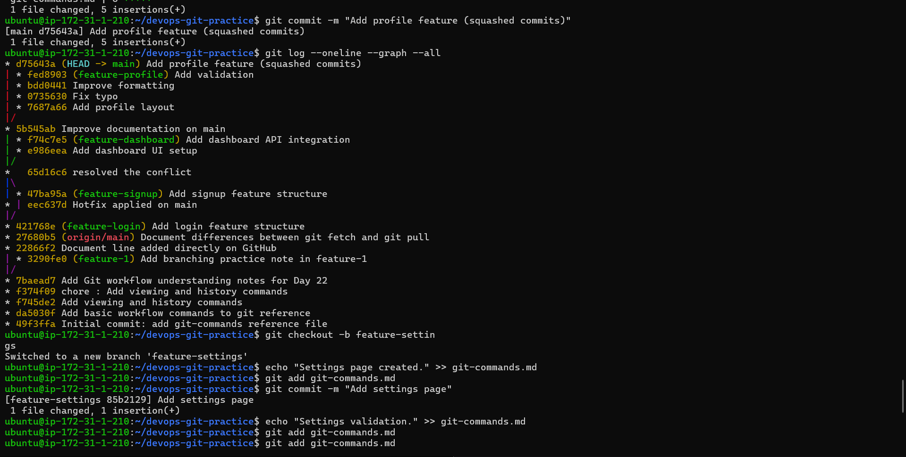
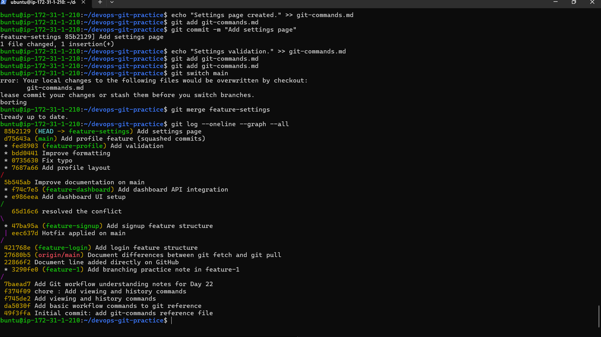
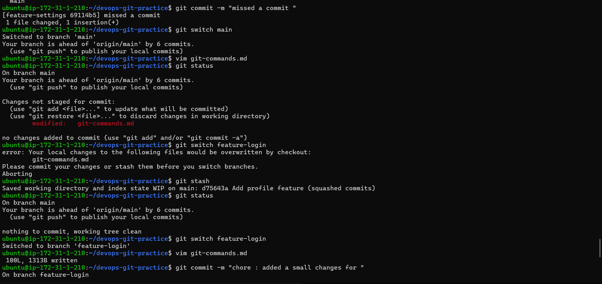
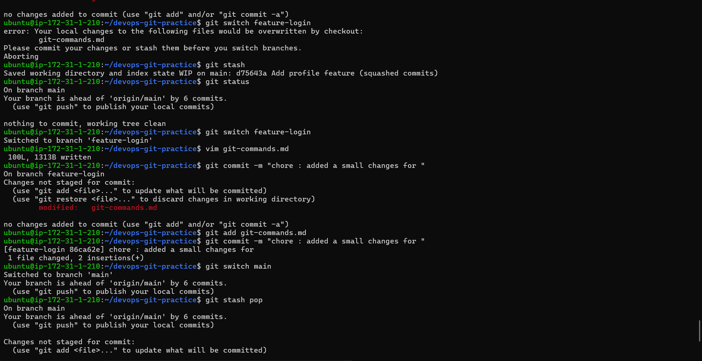
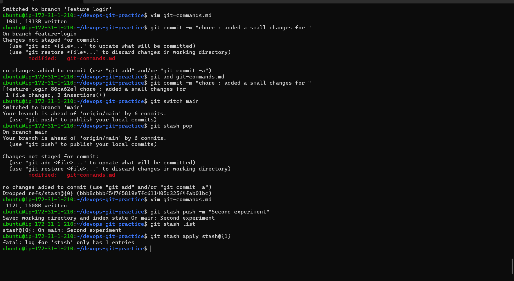

### Day 24 – Advanced Git: Merge, Rebase, Stash & Cherry Pick
Overview

Today I explored advanced Git workflows including:

Fast-forward merge

Merge commits

Merge conflicts

Rebase

Squash merge

Git stash

Cherry-pick

This session helped me understand how branches come back together and how Git history can be managed cleanly.

Task 1 – Git Merge
Fast-Forward Merge

A fast-forward merge happens when:

The target branch has not moved ahead.

Git simply moves the pointer forward.

No merge commit is created.

Example:
```bash

main: A
feature: A → B → C

After merge:
main: A → B → C
Merge Commit
```
When both branches have new commits:

Git creates a merge commit.

History preserves both branch paths.

Example:
```bash
main: A → B
feature: A → C

After merge:
main: A → B → M
               ↘ C
```

M is a merge commit with two parents.

Merge Conflict

A merge conflict happens when:

The same file

The same line

Is modified differently in two branches.

Git inserts conflict markers:

current branch content
incoming branch content
Resolution steps:
```bash
git add <file>
git commit
```





### Task 2 – Git Rebase

Rebase moves feature branch commits on top of the latest main branch.

Before rebase:

main: A → B
feature: A → C → D

After rebase:

main: A → B
feature: A → B → C' → D'

Commit hashes change.
| Merge                    | Rebase                        |
| ------------------------ | ----------------------------- |
| Preserves history        | Rewrites history              |
| Creates merge commit     | Creates linear history        |
| Safe for shared branches | Dangerous for pushed branches |






TASK 2
### Task 3 – Squash Merge

Using:
```bash
git merge --squash feature-branch
```
Squash merge:

Combines all feature commits into one single commit.

Creates cleaner history.

Hides intermediate development steps.

Regular merge keeps all commits.

Squash vs Regular Merge

Squash:

Clean history

Good for small features

Less detailed history

Regular:

Full commit visibility

Better for collaboration tracking




### Task 4 – Git Stash

Used to temporarily save uncommitted work.

Basic usage:
```bash
git stash
git stash list
git stash pop
git stash apply stash@{0}
```
Difference
```bash
git stash pop
```
Applies stash

Removes it from stash list
```bash
git stash apply
```
Applies stash

Keeps it in stash list

Real-World Use Case

When:

You are in the middle of a feature

An urgent bug needs fixing

You switch branches without committing unfinished work

### Task 5 – Cherry Pick

Cherry-pick applies one specific commit from another branch.
```bash
git cherry-pick <commit-hash>
```
It:

Copies a single commit

Applies it to current branch

Creates a new commit

Conflict Resolution During Cherry Pick

If conflict occurs:
```bash
git add <file>
git cherry-pick --continue
```
Abort operation:
```bash
git cherry-pick --abort
```
When to Use Cherry Pick

Apply urgent hotfix to main

Backport specific fixes

Selectively move commits

Commands Added to git-commands.md
```bash
git merge

git merge --squash

git rebase

git stash

git stash list

git stash pop

git cherry-pick

git cherry-pick --continue

git cherry-pick --abort
```
3






