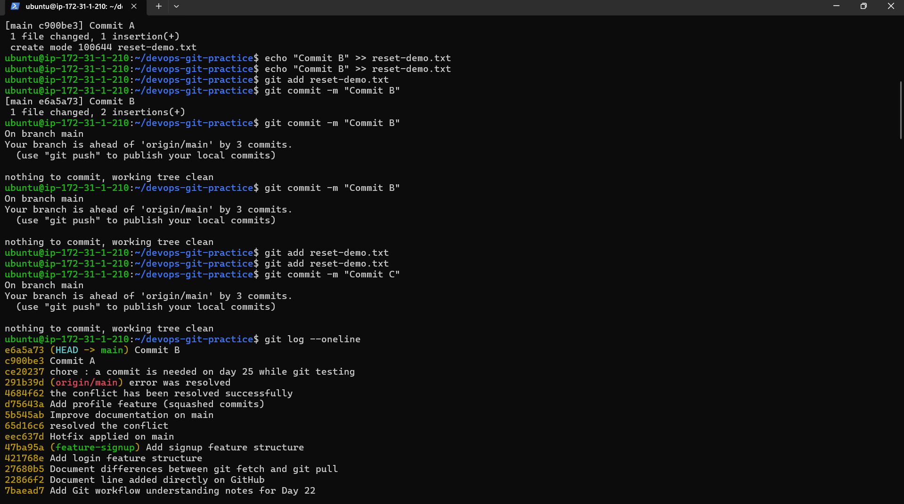

Day 25 – Git Reset vs Revert & Branching Strategies
Overview

Today I explored how to safely undo mistakes in Git and studied real-world branching strategies used by engineering teams.

This included hands-on practice with:

git reset (soft, mixed, hard)
```bash
git reset --soft
git reset --mixed
git reset --hard
git revert
```
Comparing reset vs revert

Branching strategies: GitFlow, GitHub Flow, Trunk-Based Development

Task 1 – Git Reset (Hands-On)

I created three commits (A, B, C) and experimented with different reset modes.

1. git reset --soft
git reset --soft HEAD~1

What happens:

Last commit removed

Changes remain staged

Ready to recommit

Use case:

Rewriting last commit message

Combining commits before pushing

2.git reset --mixed (default)
git reset --mixed HEAD~1

What happens:

Last commit removed

Changes remain in working directory

Changes become unstaged

Use case:

Modify changes before recommitting

3. 
```bash
git reset --hard
git reset --hard HEAD~1
```
What happens:

Last commit removed

Changes deleted

Working directory reset

This is destructive.

Never use --hard on shared branches.

Task 2 – Git Revert (Hands-On)

I created commits X, Y, Z and reverted the middle commit.

git revert <commit-hash>

What happens:

A new commit is created

The original commit remains in history

Its changes are reversed safely

Revert is safe for shared branches.

| Feature                          | git reset                     | git revert                                     |
| -------------------------------- | ----------------------------- | ---------------------------------------------- |
| What it does                     | Moves branch pointer backward | Creates new commit that undoes previous commit |
| Removes commit from history?     | Yes                           | No                                             |
| Safe for pushed/shared branches? | No                            | Yes                                            |
| Rewrites history?                | Yes                           | No                                             |
| Creates new commit?              | No                            | Yes                                            |
| Use case                         | Local cleanup                 | Production-safe undo                           |


Task 4 – Branching Strategies
1. GitFlow

Structure:

main
develop
```bash
feature/*
release/*
hotfix/*
```
How it works:

Features branch from develop

Releases branch from develop

Hotfixes branch from main

Used in:

Large teams

Enterprise environments

Pros:

Structured workflow

Clear release cycles

Cons:

Complex

Heavy process

2. GitHub Flow

Structure:

main
feature branches

How it works:

Create branch from main

Open pull request

Merge after review

Used in:

Startups

Continuous deployment teams

Pros:

Simple

Fast

Lightweight

Cons:

Less structured for large release cycles

3. Trunk-Based Development

Structure:

main (trunk)
short-lived branches

How it works:

Developers commit frequently to main

Use feature flags

Small, frequent merges

Used in:

CI/CD environments

High-performance DevOps teams

Pros:

Fast integration

Fewer long-running branches

Cons:

Requires strong testing

Requires discipline

Strategy Choice

For startups shipping fast:
→ GitHub Flow

For large enterprise with scheduled releases:
→ GitFlow

For high-performing CI/CD teams:
→ Trunk-Based Development

Commands Added to git-commands.md
```bash
git reset

git reset --soft

git reset --mixed

git reset --hard

git revert

git reflog


        ```




