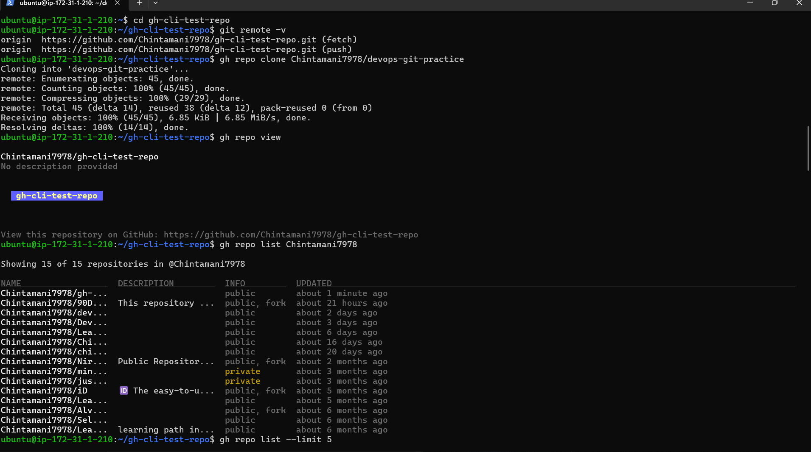
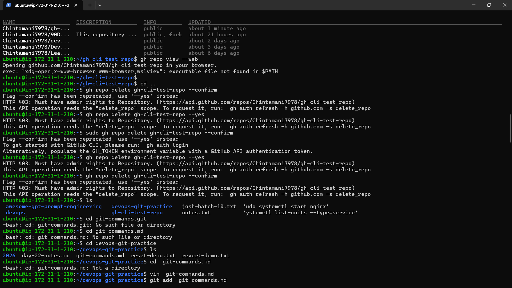
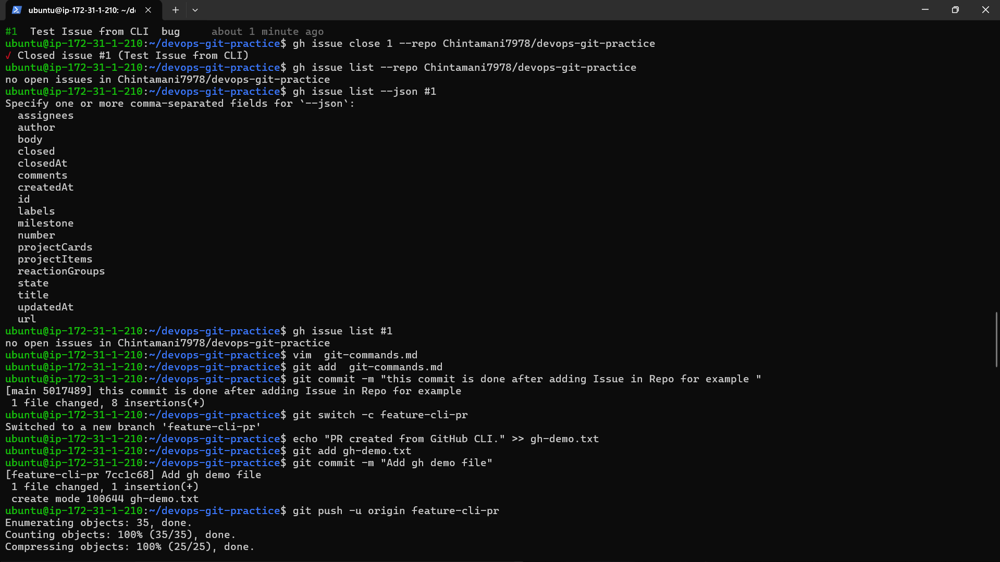
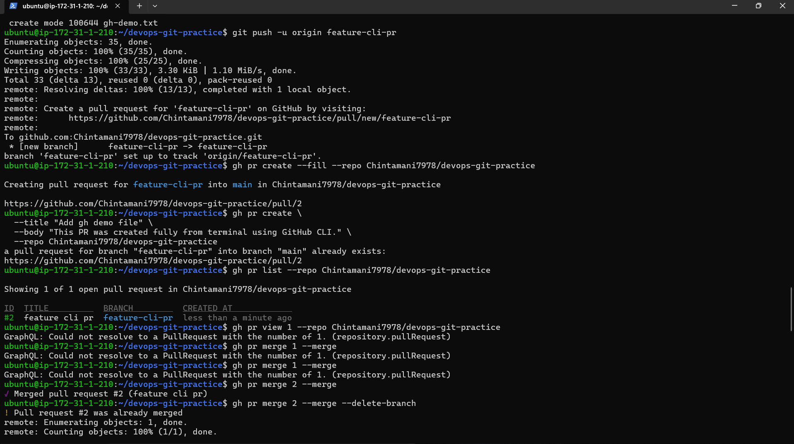
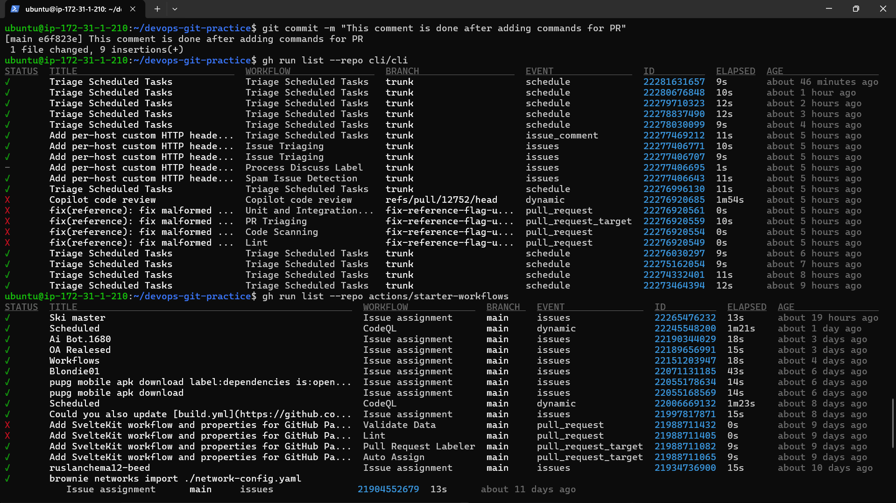
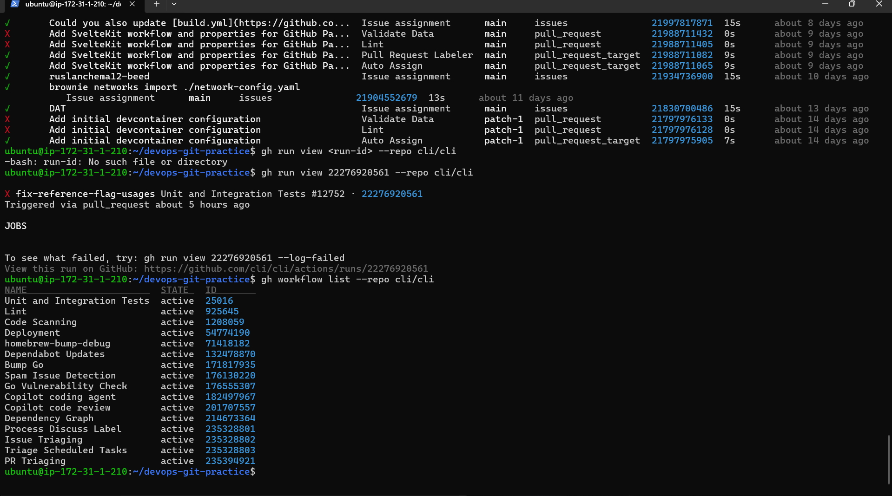

### Day 26 – GitHub CLI: Manage GitHub from Your Terminal
Overview

Today I learned how to manage GitHub entirely from the terminal using the GitHub CLI (gh).

This eliminates constant browser switching and enables automation for repositories, issues, pull requests, and workflows — a critical skill for DevOps engineers.

Task 1 – Install & Authenticate
Installation

On Ubuntu/Debian:
```bash
sudo apt update
sudo apt install gh -y
```
Verify installation:
```bash
gh --version
Authentication
gh auth login
```
Steps:

GitHub.com

SSH protocol

Web-based login

Verify login:

gh auth status
Authentication Methods Supported by gh

Web-based OAuth login

Personal Access Token (PAT)

SSH-based Git authentication

GitHub Enterprise support

Task 2 – Working with Repositories
Create Repository from Terminal
```bash
gh repo create gh-cli-test-repo --public --clone --add-readme
```
Clone Repository
```bash
gh repo clone owner/repository-name
```
View Repository Details
```bash
gh repo view
```
```bash
gh repo view owner/repository-name
```
List All Repositories
```bash
gh repo list username
```
Open Repository in Browser
```bash
gh repo view --web
```
Delete Repository
```bash
gh repo delete repository-name --confirm
```
Task 3 – Issues Management
Create Issue
```bash
gh issue create \
  --title "Test Issue from CLI" \
  --body "Created using GitHub CLI." \
  --label bug
  ```
List Issues
gh issue list
View Specific Issue
```bash
gh issue view <issue-number>
```
Close Issue
```bash
gh issue close <issue-number>
```
Automation Use Case

gh issue can be used to:

Automatically create issues when CI fails

Generate issues from monitoring alerts

Close issues after deployment

Integrate with scripts using --json

Example:
```bash
gh issue list --json title,number
```
Task 4 – Pull Requests from Terminal
```bash
Create Branch and Push
git switch -c feature-cli-pr
git push -u origin feature-cli-pr
```
Create Pull Request
```bash
gh pr create --fill
```
Or manually:

gh pr create --title "Add feature" --body "Created via CLI"
List PRs
gh pr list
View PR
gh pr view <pr-number>
Merge PR
```bash
gh pr merge <pr-number> --merge
gh pr merge <pr-number> --squash
gh pr merge <pr-number> --rebase
```
Review PR from Terminal
```bash
gh pr checkout <pr-number>
gh pr diff <pr-number>
gh pr review <pr-number> --approve
```
Task 5 – GitHub Actions Preview
```bash
List Workflow Runs
gh run list --repo owner/repo
```
View Workflow Run
```bash
gh run view <run-id> --repo owner/repo
```
List Workflows
```bash
gh workflow list --repo owner/repo
```
CI/CD Use Case
```bash
gh run list --json status,conclusion
gh run and gh workflow help to:
```
Monitor CI pipelines from terminal

Debug failed builds

Trigger workflows

Integrate build checks into automation scripts

Example:
```bash
gh run list --json status,conclusion
```
Task 6 – Useful gh Commands

Create Gist
```bash
gh gist create file.txt
```
Search Repositories
```bash
gh search repos devops --limit 5
```
Create Alias
```bash
gh alias set prlist "pr list --limit 5"
```
GitHub API Call
```bash
gh api repos/username/repository
```
Commands Added to git-commands.md
```bash
gh auth login

gh auth status

gh repo create

gh repo clone

gh repo list

gh repo view

gh repo delete

gh issue create

gh issue list

gh issue view

gh issue close

gh pr create

gh pr list

gh pr view

gh pr merge

gh pr checkout

gh pr review

gh pr diff

gh run list

gh workflow list

gh api

gh alias set

gh search repos

```
Here are all images while doing handson





