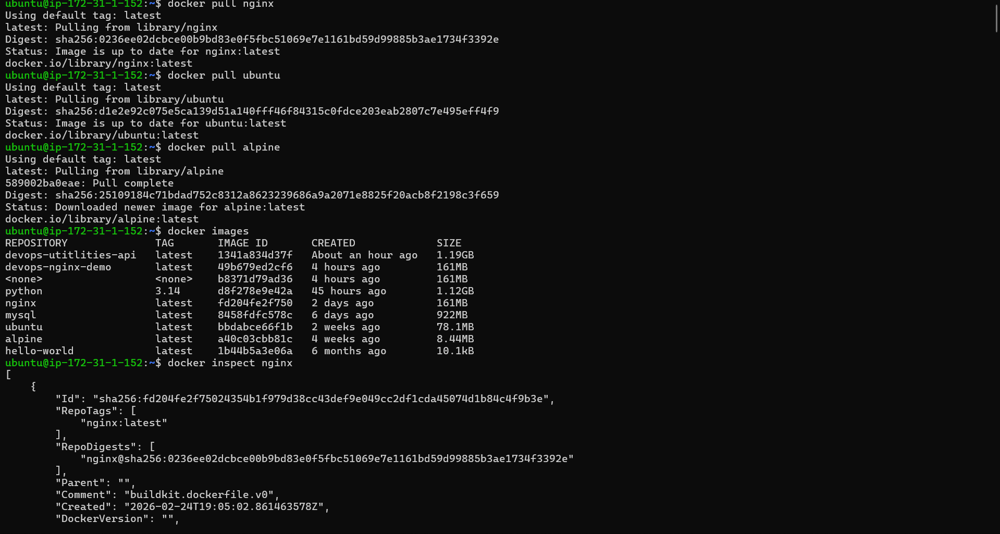
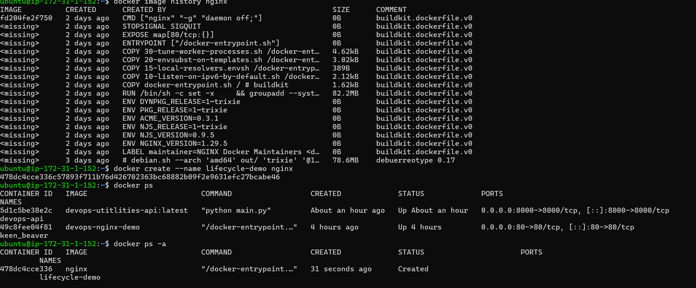
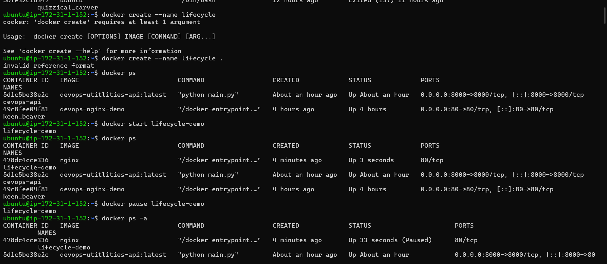
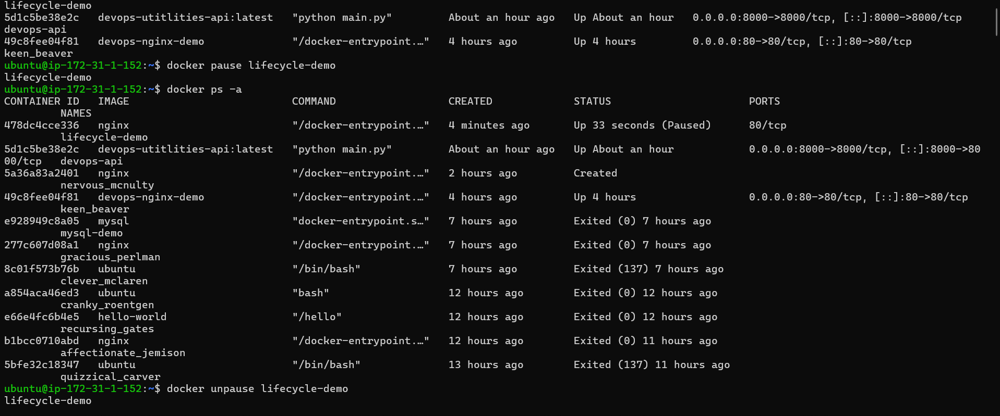
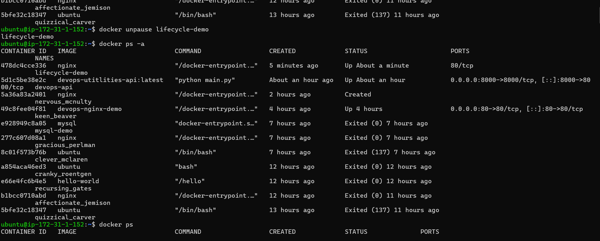
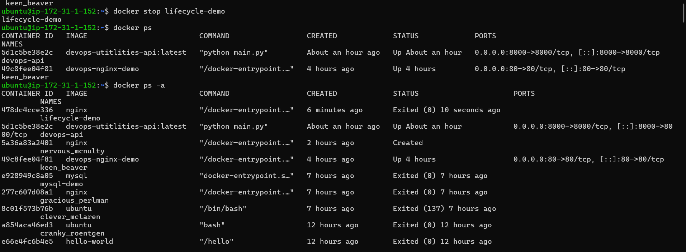
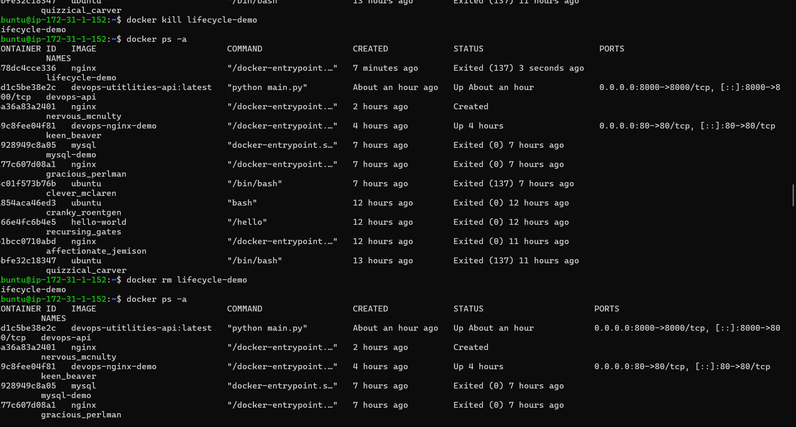
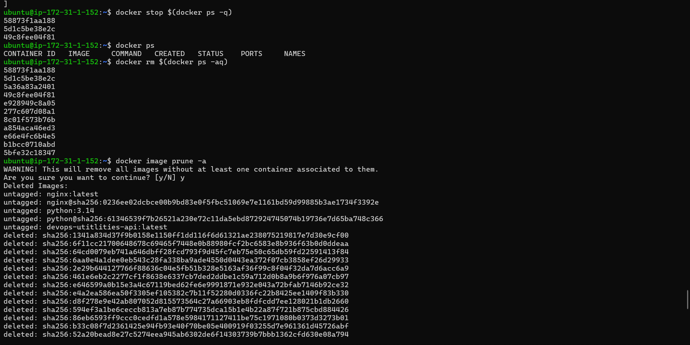
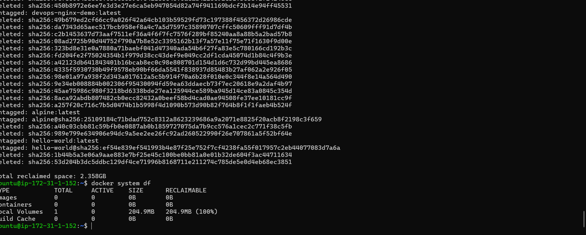

## Day 30 – Docker Images & Container Lifecycle
Overview

Today I went deeper into Docker by understanding how images and containers actually work.

Instead of just running containers, I explored:

Image structure and layers

How Docker uses caching

The complete container lifecycle

Container networking and inspection

System cleanup and disk management

This helped me understand what happens internally when we run a container.

# Task 1 – Docker Images
Pull Images
```bash
docker pull nginx
docker pull ubuntu
docker pull alpine
```
List Images
docker images
Observations
```bash
nginx → ~161MB

ubuntu → ~78MB

alpine → ~8MB
```


Why Alpine is Smaller?

Alpine is a minimal Linux distribution.

It contains very few packages.

Uses musl instead of glibc.

Designed specifically for lightweight containers.

Ubuntu is larger because it includes more system tools and libraries.

Inspect an Image
docker inspect nginx

From inspection:

Architecture: amd64
```bash
OS: linux
```
Default CMD:
```bash
nginx -g "daemon off;"
```
Important concept:
A container runs as long as its main process runs.
Here, nginx runs in foreground mode.

Remove an Image
```bash
docker rmi alpine
```
(Only works if no container is using it.)

# Task 2 – Image Layers
```bash
docker image history nginx
```
What I Observed

Multiple layers

Some layers show size (MB)

Some layers show 0B

What Are Layers?

Every instruction in a Dockerfile creates a new layer:
```bash

FROM

RUN

COPY

ENV

CMD
```
Each becomes a read-only layer.

Why Some Layers Show 0B?

Instructions like:
```bash
ENV

CMD

EXPOSE

LABEL
```
Only change metadata, not filesystem — so they show 0B.

Why Docker Uses Layers

Efficient storage (shared layers)

Faster builds (layer caching)

Reusability across images

If two images use the same base (like Ubuntu), Docker stores that base layer only once.

# ask 3 – Container Lifecycle

Using a test container:

Create (Without Starting)
```bash
docker create --name lifecycle-demo nginx
```
Status: Created

Start
```bash
docker start lifecycle-demo
```

Status: Up

Pause
```bash
docker pause lifecycle-demo
```
Status: Paused

Pause freezes processes but does not stop the container.

Unpause
```bash
docker unpause lifecycle-demo
```
Stop (Graceful)
```bash
docker stop lifecycle-demo
```

Sends SIGTERM and waits for clean shutdown.

Restart
```bash
docker restart lifecycle-demo
```

Equivalent to stop + start.
```bash
docker start lifecycle-demo
```

Kill (Force Stop)
```bash
docker kill lifecycle-demo
```
Sends SIGKILL and immediately terminates the container.

Remove Container
```bash
docker rm lifecycle-demo
```


Deletes the container permanently.

# Task 4 – Working with Running Containers
Run Nginx in Detached Mode
```bash
docker run -d -p 8080:80 --name prod-nginx nginx
```
-d → Run in background

-p → Port mapping

--name → Custom name

Access via:
```bash
http://<host-ip>:8080
```
View Logs
```bash
docker logs prod-nginx
```
Real-Time Logs
```bash
docker logs -f prod-nginx
```

Exec into Container
```bash
docker exec -it prod-nginx bash
```
Explore filesystem like a mini Linux machine.

Run Single Command Inside Container
```bash
docker exec prod-nginx ls /
```
Inspect Container
```bash
docker inspect prod-nginx
```
Important findings:
```bash
Hostname: prod-nginx

Internal IP: 172.17.0.4
```
```bash
Port mapping: 8080 → 80
```
Network mode: bridge

Without -p, the container is not accessible externally.

# Task 5 – Cleanup

Stop All Running Containers
```bash
docker stop $(docker ps -q)
```
Remove All Containers
```bash
docker rm $(docker ps -aq)
```

Remove Unused Images
```bash
docker image prune -a
```

Check Docker Disk Usage
```bash
docker system df
```
