# Day 31 – Dockerfile: Build Your Own Images

Part of #90DaysOfDevOps  
Focus: Writing Dockerfiles and Building Custom Images

---

# Objective

The goal of Day 31 is to understand how Docker images are built using Dockerfiles and how to create optimized, production-ready container images.

This includes:

- Writing basic Dockerfiles
- Understanding core Dockerfile instructions
- Learning the difference between CMD and ENTRYPOINT
- Building a static website image
- Using .dockerignore
- Understanding Docker layer caching and build optimization

---

# Task 1: Your First Dockerfile

## Folder Structure

my-first-image/
└── Dockerfile

## Dockerfile

```Dockerfile
FROM ubuntu:latest

RUN apt-get update && apt-get install -y curl

CMD ["echo", "Hello from my custom image!"]
```

## Explanation

FROM  
Defines the base image. Every Docker image must start from a base image.

RUN  
Executes commands during image build time. Here it installs curl.

CMD  
Defines the default command that runs when a container starts.

## Build Command

```bash
docker build -t my-ubuntu:v1 .
```

## Run Command

```bash
docker run my-ubuntu:v1
```

Expected Output:
Hello from my custom image!

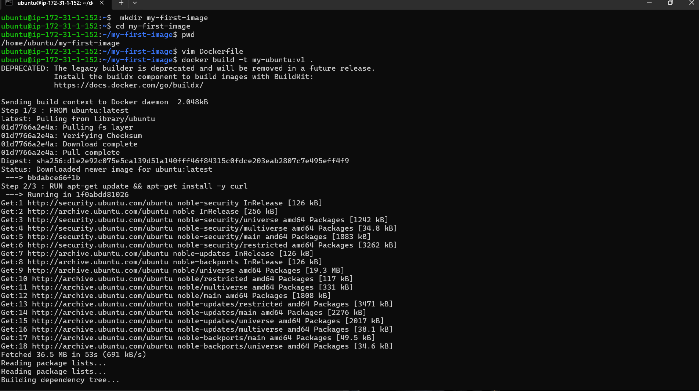
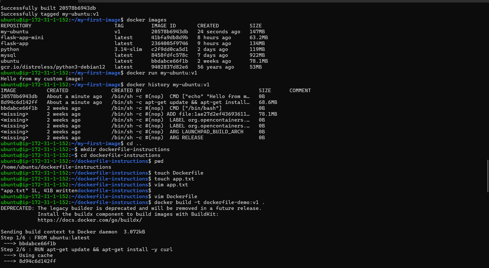
---

# Task 2: Using All Core Dockerfile Instructions

## Folder Structure

dockerfile-instructions/
├── Dockerfile
└── app.txt

## app.txt

```
Dockerfile instructions demo successful!
```

## Dockerfile

```Dockerfile

FROM ubuntu:latest

RUN apt-get update && apt-get install -y curl

WORKDIR /app

COPY app.txt .

EXPOSE 8080

CMD ["cat", "app.txt"]
```

## Instruction Breakdown

FROM  
Specifies the base image.

RUN  
Executes commands during the image build process.

WORKDIR  
Sets the working directory inside the container. If it does not exist, it is created automatically.

COPY  
Copies files from the host system to the container image.

EXPOSE  
Documents the port the container intends to use. It does not publish the port automatically.

CMD  
Defines the default command executed when the container starts.

---
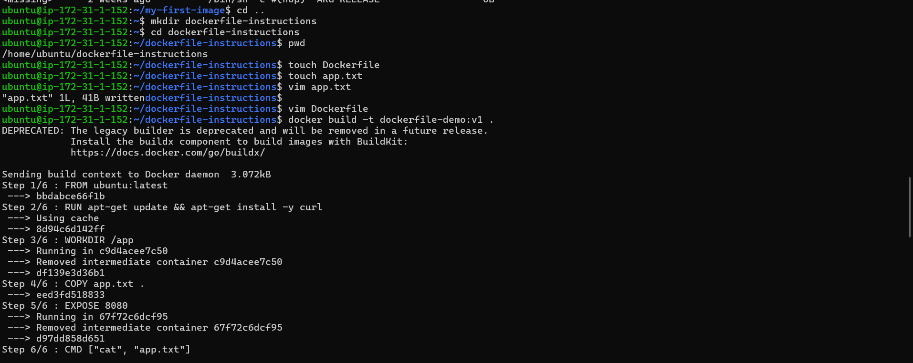
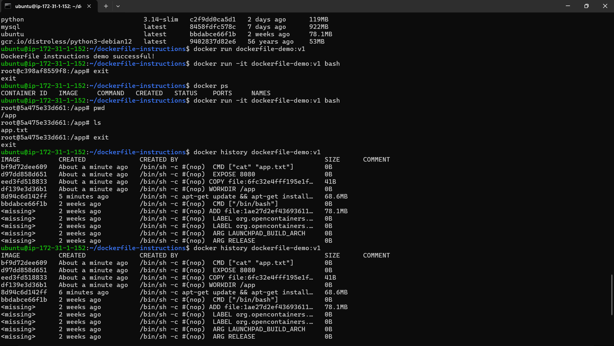

# Task 3: CMD vs ENTRYPOINT

## CMD Example

Dockerfile.cmd

```Dockerfile
FROM ubuntu
CMD ["echo", "hello"]
```

Build:

```bash
docker build -t cmd-image -f Dockerfile.cmd .
```

Run:

```bash
docker run cmd-image
docker run cmd-image hi
```

Observation:

- First command prints: hello
- Second command prints: hi

Reason: CMD can be overridden by passing arguments in docker run.

---

## ENTRYPOINT Example

Dockerfile.entrypoint

```Dockerfile
FROM ubuntu
ENTRYPOINT ["echo"]
```

Build:

```bash
docker build -t entry-image -f Dockerfile.entrypoint .
```

Run:

```bash
docker run entry-image hello
docker run entry-image DevOps
```

Observation:

- echo is always executed
- Arguments passed to docker run are appended to ENTRYPOINT

---

## When to Use CMD vs ENTRYPOINT

Use CMD when:
- You want to provide a default command
- You expect users to override it

Use ENTRYPOINT when:
- You want to enforce a fixed executable
- The container behaves like a dedicated tool

In production systems, ENTRYPOINT is commonly used to define the main application process.
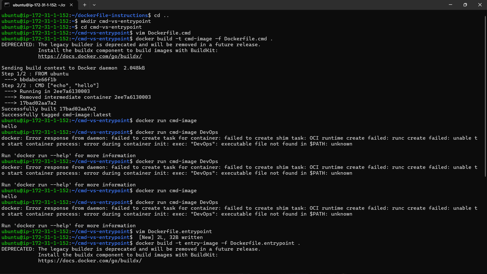
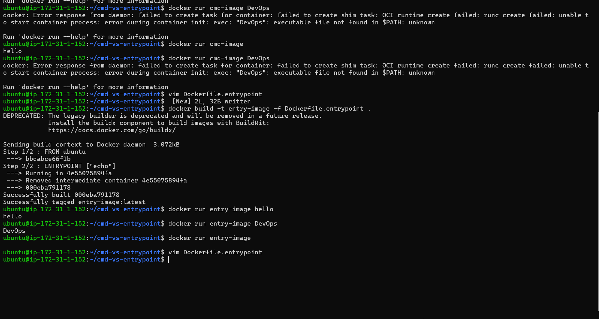
---

# Task 4: Build a Simple Web App Image

## Folder Structure

my-website/
├── Dockerfile
└── index.html

## index.html

```html
<!DOCTYPE html>
<html>
<head>
    <title>My Docker Website</title>
</head>
<body>
    <h1>Hello from Docker</h1>
</body>
</html>
```

## Dockerfile

```Dockerfile
FROM nginx:alpine

COPY index.html /usr/share/nginx/html/

EXPOSE 80
```

## Build

```bash
docker build -t my-website:v1 .
```

## Run

```bash
docker run -d -p 8080:80 my-website:v1
```

Access in browser:

http://localhost:8080

Explanation:

nginx:alpine is a lightweight Nginx image.  
The HTML file is copied into Nginx’s default web root directory.  
Port 80 is exposed and mapped to host port 8080.

---
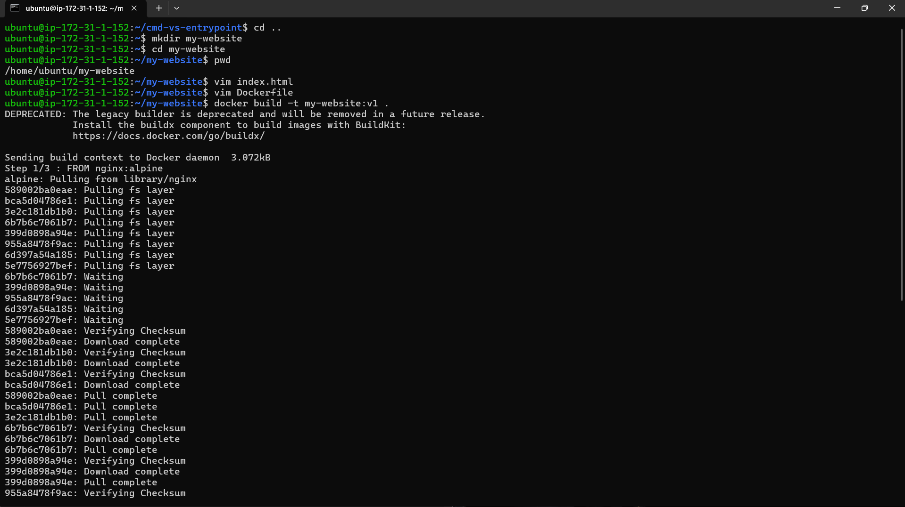
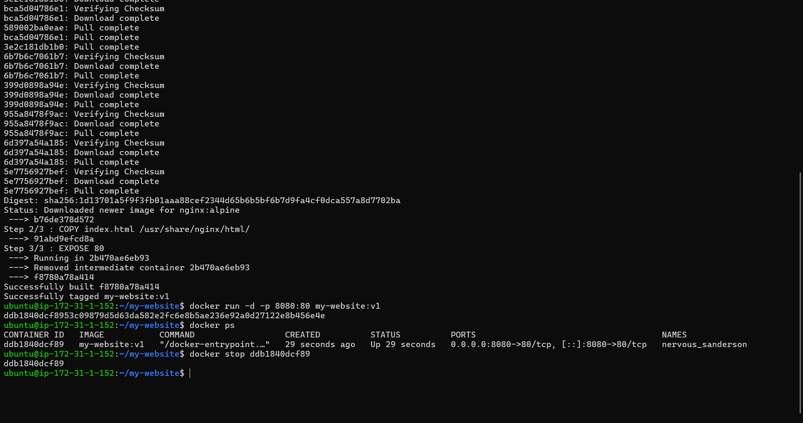

# Task 5: .dockerignore

## .dockerignore File

```
node_modules
.git
*.md
.env
```

Purpose:

- Prevents unnecessary files from being sent in the build context
- Reduces image size
- Improves build speed
- Avoids leaking sensitive files

To verify:

Build the image and inspect it using:

```bash
docker run -it image-name sh
```

Check that ignored files are not present.

---

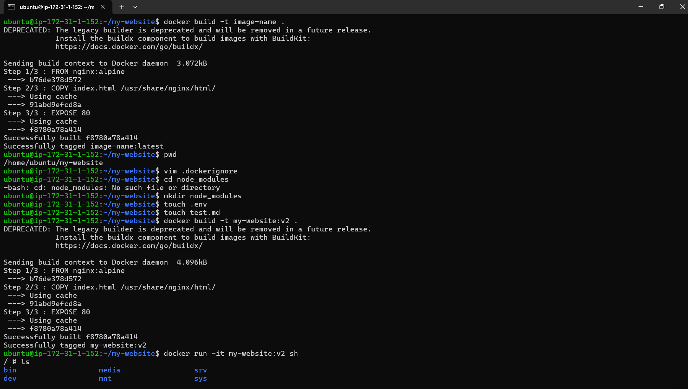
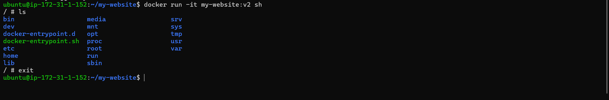

# Task 6: Build Optimization and Layer Caching

## Understanding Docker Layers

Each instruction in a Dockerfile creates a layer.

Docker caches layers to improve build performance.

If a layer changes, Docker rebuilds that layer and all layers after it.

---

## Example

Bad Order:

```Dockerfile
COPY . .
RUN npm install
```

If any source code changes, npm install runs again.

Better Order:

```Dockerfile
COPY package.json .
RUN npm install
COPY . .
```

Now dependencies are only reinstalled when package.json changes.

---
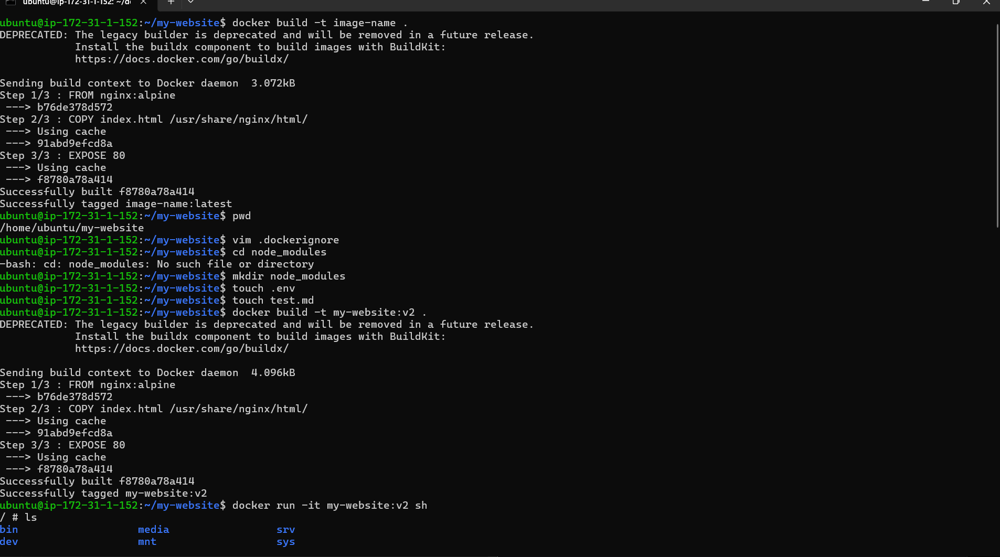
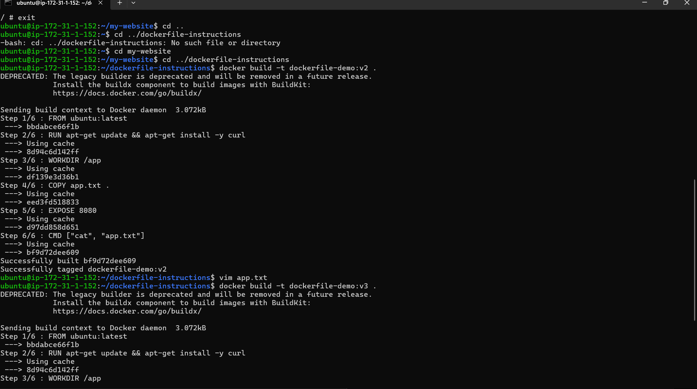
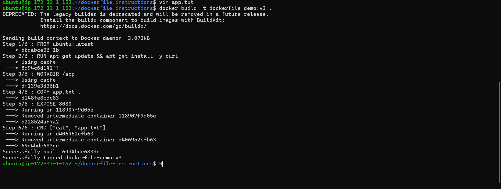

## Why Layer Order Matters

- Reduces rebuild time
- Improves CI/CD efficiency
- Saves bandwidth and compute resources
- Makes images more production-friendly

