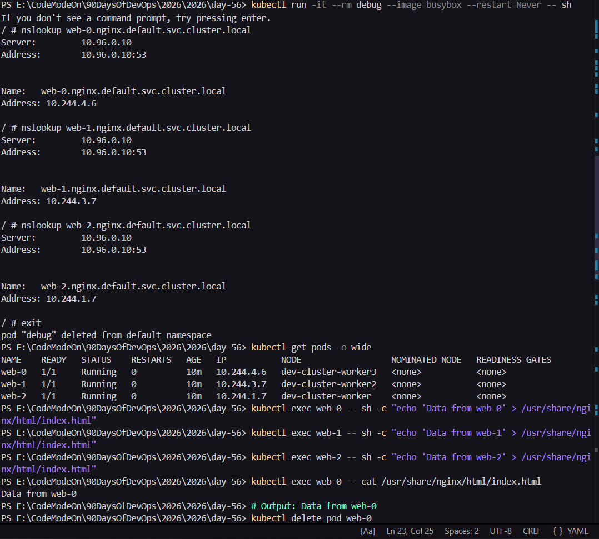
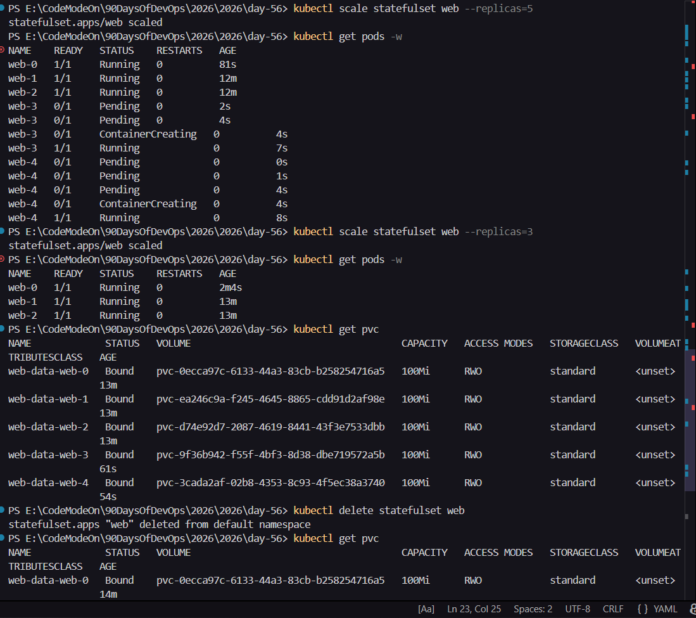
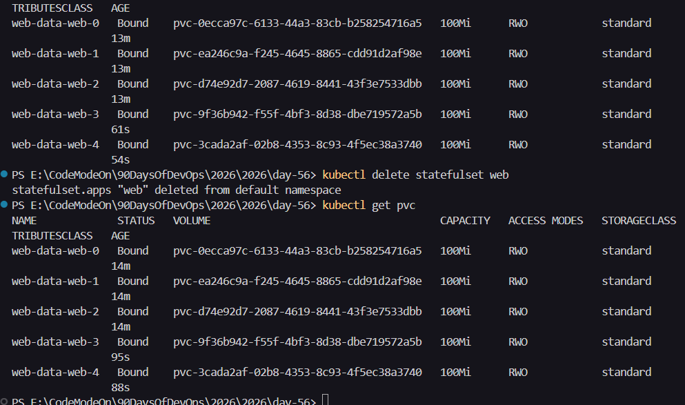

# Day 56 - Kubernetes StatefulSets

## What Is a StatefulSet?
StatefulSet is a Kubernetes workload controller used for stateful applications where each pod needs:

- Stable identity (fixed pod names)
- Stable network identity (fixed DNS names)
- Stable storage (pod-specific persistent volumes)

StatefulSets are commonly used for databases, message brokers, and clustered systems like MySQL, PostgreSQL, MongoDB, Kafka, and ZooKeeper.

## Deployment vs StatefulSet

| Feature | Deployment | StatefulSet |
|---|---|---|
| Pod names | Random suffix names | Stable ordered names (`web-0`, `web-1`, `web-2`) |
| Pod startup | Parallel (no strict order) | Ordered (`0 -> 1 -> 2`) |
| Pod termination | No guaranteed order | Reverse ordered (`2 -> 1 -> 0`) |
| Storage | Usually shared or stateless | One PVC per pod via `volumeClaimTemplates` |
| Network identity | No stable pod DNS identity | Stable per-pod DNS |

## Task 1: Understand the Problem

### Commands
```bash
kubectl apply -f Deployment.yml
kubectl get pods -l app=web
kubectl delete pod <one-pod-name>
kubectl get pods -l app=web
kubectl delete deployment web
```

### Observation
- Deployment pod names include random hashes.
- When a pod is deleted, a new pod is created with a different random name.

### Verify Answer
Random pod names are a problem for database clusters because replicas/nodes often depend on fixed identities for membership, replication, leader election, and peer discovery. If identity changes after restart, cluster coordination can break.

---

## Task 2: Create a Headless Service

### Manifest Used
File: `Headless-Services.yml`

```yaml
apiVersion: v1
kind: Service
metadata:
	name: nginx
	labels:
		app: web
spec:
	clusterIP: None
	selector:
		app: web
	ports:
	- port: 80
		name: web
```

### Commands
```bash
kubectl apply -f Headless-Services.yml
kubectl get svc nginx
```

### Verify Answer
The `CLUSTER-IP` column shows `None`, confirming it is a headless service.

---

## Task 3: Create a StatefulSet

### Manifest Used
File: `statefulset.yml`

```yaml
apiVersion: apps/v1
kind: StatefulSet
metadata:
	name: web
spec:
	serviceName: "nginx"
	replicas: 3
	selector:
		matchLabels:
			app: web
	template:
		metadata:
			labels:
				app: web
		spec:
			containers:
			- name: nginx
				image: nginx:latest
				ports:
				- containerPort: 80
					name: web
				volumeMounts:
				- name: web-data
					mountPath: /usr/share/nginx/html
	volumeClaimTemplates:
	- metadata:
			name: web-data
		spec:
			accessModes: ["ReadWriteOnce"]
			resources:
				requests:
					storage: 100Mi
```

### Commands
```bash
kubectl apply -f statefulset.yml
kubectl get pods -l app=web -w
kubectl get pvc
```

### Observation
- Pods are created in order: `web-0`, then `web-1`, then `web-2`.
- One PVC is created per pod.

### Verify Answer
- Pod names: `web-0`, `web-1`, `web-2`
- PVC names: `web-data-web-0`, `web-data-web-1`, `web-data-web-2`

---

## Task 4: Stable Network Identity

### Commands
```bash
kubectl run -it --rm debug --image=busybox:1.28 --restart=Never -- sh
nslookup web-0.nginx.default.svc.cluster.local
nslookup web-1.nginx.default.svc.cluster.local
nslookup web-2.nginx.default.svc.cluster.local
exit

kubectl get pods -l app=web -o wide
```

### Observation
- Each pod resolves through stable DNS names.
- Resolved IPs correspond to individual pod IPs.

### Verify Answer
Yes, the `nslookup` IPs match the pod IPs from `kubectl get pods -o wide`.

---

## Task 5: Stable Storage (Data Survives Pod Deletion)

### Commands
```bash
kubectl exec web-0 -- sh -c "echo 'Data from web-0' > /usr/share/nginx/html/index.html"
kubectl exec web-0 -- cat /usr/share/nginx/html/index.html

kubectl delete pod web-0
kubectl get pods -l app=web -w

kubectl exec web-0 -- cat /usr/share/nginx/html/index.html
```

### Observation
- After deleting `web-0`, Kubernetes recreates `web-0` (same identity).
- Data remains because `web-0` reattaches to `web-data-web-0` PVC.

### Verify Answer
Yes, the data is identical after pod recreation (`Data from web-0`).

---

## Task 6: Ordered Scaling

### Commands
```bash
kubectl scale statefulset web --replicas=5
kubectl get pods -l app=web -w

kubectl scale statefulset web --replicas=3
kubectl get pods -l app=web -w

kubectl get pvc
```

### Observation
- Scale up creates pods in order: `web-3`, then `web-4`.
- Scale down terminates in reverse order: `web-4`, then `web-3`.
- PVCs remain after scale-down.

### Verify Answer
After scaling down to 3 pods, **5 PVCs** still exist (`web-data-web-0` to `web-data-web-4`).

---

## Task 7: Clean Up

### Commands
```bash
kubectl delete statefulset web
kubectl delete svc nginx
kubectl get pvc

kubectl delete pvc web-data-web-0 web-data-web-1 web-data-web-2 web-data-web-3 web-data-web-4
kubectl get pvc
```

### Observation
- Deleting StatefulSet does not delete PVCs automatically.
- PVCs must be removed manually.

### Verify Answer
No, PVCs were not auto-deleted with StatefulSet.

---

## How It Works (Concept Summary)

### 1. Headless Service (`clusterIP: None`)
Creates DNS records for each pod instead of a single load-balanced service IP.

### 2. Stable DNS Pattern
Each pod gets:

`<pod-name>.<service-name>.<namespace>.svc.cluster.local`

Example:

- `web-0.nginx.default.svc.cluster.local`
- `web-1.nginx.default.svc.cluster.local`
- `web-2.nginx.default.svc.cluster.local`

### 3. `volumeClaimTemplates`
Kubernetes automatically creates a dedicated PVC per replica:

`<template-name>-<pod-name>`

Example:

- `web-data-web-0`
- `web-data-web-1`
- `web-data-web-2`

This guarantees each pod gets its own persistent disk.

---

## Screenshots to Add (Optional but Recommended)
- `kubectl get pods -l app=web -o wide`
- `kubectl get pvc`
- `nslookup web-0.nginx.default.svc.cluster.local`
- Before/after pod deletion data check

---

## Final Learning
Today I learned why StatefulSets are essential for stateful workloads. They provide stable pod names, stable DNS identities, and persistent per-pod storage that survives restarts, scale operations, and pod recreation.

screenshots



