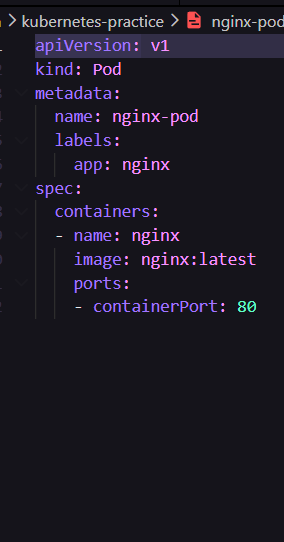
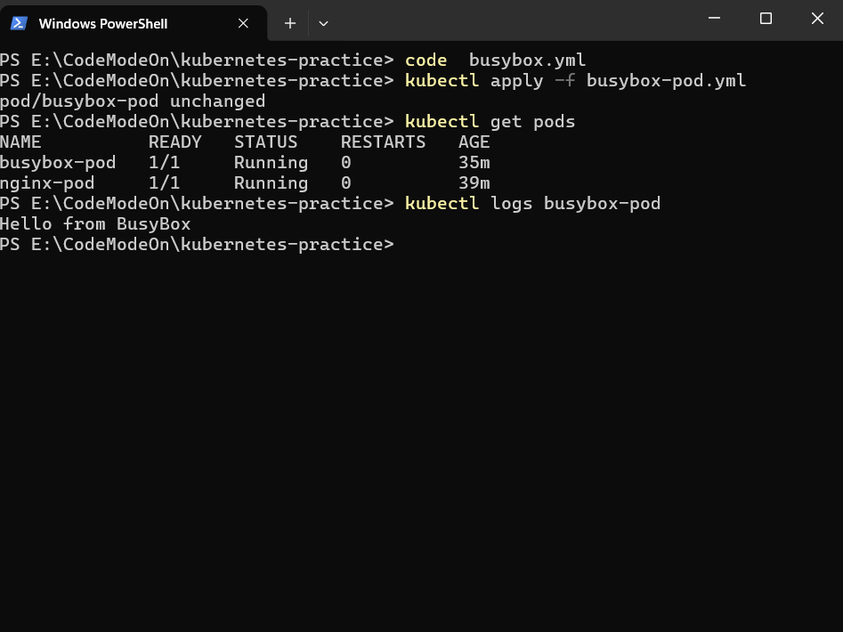
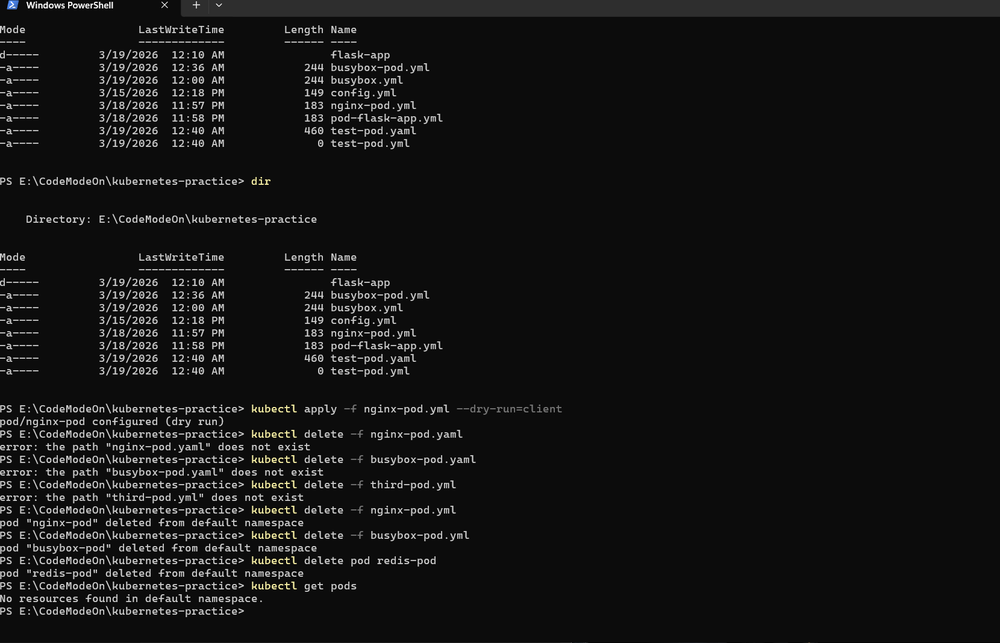

# Day 51 – Kubernetes Manifests and Pod Lifecycle

## Overview

This exercise demonstrates the creation and management of Kubernetes Pods using YAML manifests. It covers declarative and imperative approaches, validation techniques, and label-based resource management.

---

## Objectives

* Understand Kubernetes manifest structure
* Create Pods using YAML (declarative approach)
* Execute and debug containers
* Use imperative commands for quick resource creation
* Validate manifests before deployment
* Organize and filter resources using labels

---

## Task 1 – Nginx Pod Creation

Created a Pod running an Nginx container.

```yaml
# nginx-pod.yaml
apiVersion: v1
kind: Pod
metadata:
  name: nginx-pod
  labels:
    app: nginx
    environment: dev
spec:
  containers:
  - name: nginx-container
    image: nginx:latest
    ports:
    - containerPort: 80
```


### Commands

```bash
kubectl apply -f nginx-pod.yaml
kubectl get pods
kubectl describe pod nginx-pod
kubectl exec -it nginx-pod -- /bin/sh
```

### Verification

* Pod reached `Running` state
* Verified service using `curl localhost:80` inside container

---

## Task 2 – BusyBox Pod

Created a Pod with a custom command.

```yaml
# busybox-pod.yaml
apiVersion: v1
kind: Pod
metadata:
  name: busybox-pod
  labels:
    app: busybox
    environment: dev
spec:
  containers:
  - name: busybox-container
    image: busybox:latest
    command: ["sh", "-c", "echo Hello from BusyBox && sleep 3600"]
```



### Commands

```bash
kubectl apply -f busybox-pod.yaml
kubectl logs busybox-pod
```

### Verification

* Output: `Hello from BusyBox`
* Pod remained active due to `sleep` command

---

## Task 3 – Imperative vs Declarative

### Imperative

```bash
kubectl run redis-pod --image=redis:latest
```

### Declarative

```bash
kubectl apply -f nginx-pod.yaml
```

### YAML Extraction

```bash
kubectl get pod redis-pod -o yaml
```

### Dry Run YAML Generation

```bash
kubectl run test-pod --image=nginx --dry-run=client -o yaml
```

### Observation

* Imperative is faster but not maintainable
* Declarative is version-controlled and production-ready

---

## Task 4 – Manifest Validation

### Commands

```bash
kubectl apply -f nginx-pod.yaml --dry-run=client
kubectl apply -f nginx-pod.yaml --dry-run=server
```

### Failure Test

* Removed `image` field from manifest

### Observation

* Kubernetes returned validation error for missing required field

---

## Task 5 – Labels and Filtering

### Third Pod

```yaml
# third-pod.yaml
apiVersion: v1
kind: Pod
metadata:
  name: multi-label-pod
  labels:
    app: demo
    environment: staging
    team: devops
spec:
  containers:
  - name: nginx
    image: nginx:alpine
```

### Commands

```bash
kubectl get pods --show-labels
kubectl get pods -l app=nginx
kubectl get pods -l environment=dev
kubectl label pod nginx-pod environment=production
kubectl label pod nginx-pod environment-
```

### Observation

* Labels enable efficient filtering and grouping of resources

---

## Task 6 – Cleanup

### Commands

```bash
kubectl delete -f nginx-pod.yaml
kubectl delete -f busybox-pod.yaml
kubectl delete -f third-pod.yaml
kubectl delete pod redis-pod
kubectl get pods
```

### Observation

* Standalone Pods are permanently deleted
* No automatic recreation without a controller

---

## Kubernetes Manifest Structure

| Field      | Description      |
| ---------- | ---------------- |
| apiVersion | API version used |
| kind       | Resource type    |
| metadata   | Name and labels  |
| spec       | Desired state    |

---

## Output

```bash
kubectl get pods
```

Screenshot:



---

## Project Structure

```
2026/day-51/
├── README.md
├── nginx-pod.yaml
├── busybox-pod.yaml
├── third-pod.yaml
└── screenshots/
    └── pods-running.png
```

---

## Key Takeaways

* Kubernetes resources are defined declaratively using YAML
* Pods are the smallest deployable unit
* Labels are critical for organization and selection
* Declarative approach is essential for production
* Standalone Pods are not self-healing

---

## Conclusion

This task provided hands-on experience with Kubernetes Pods, manifest validation, and resource management, forming the foundation for advanced Kubernetes objects such as Deployments.

---
