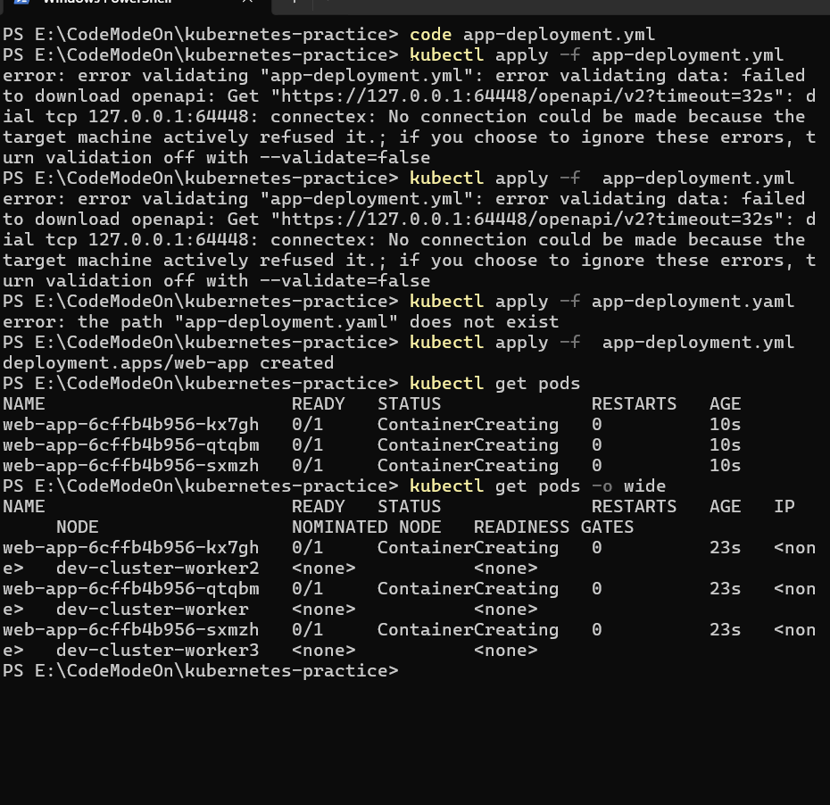
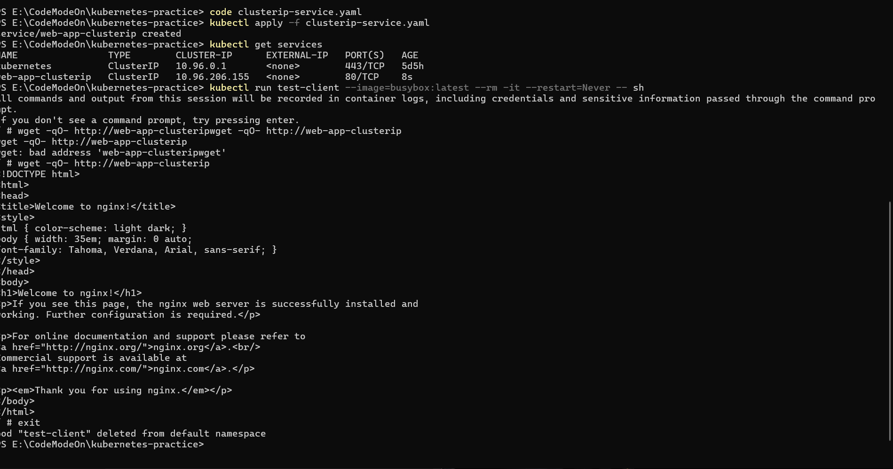
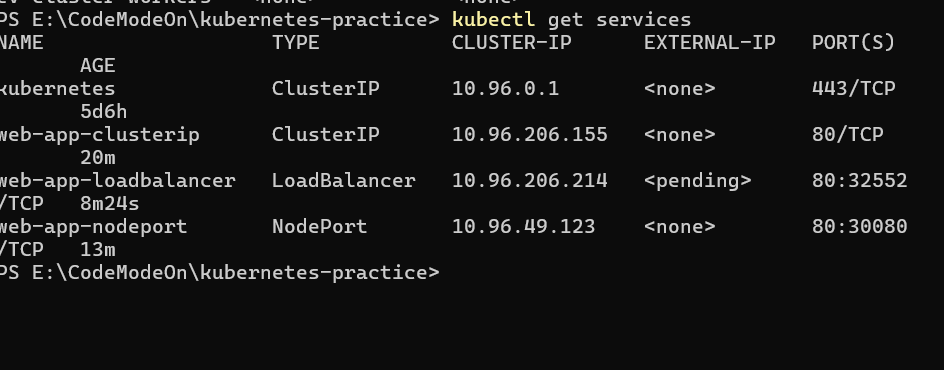
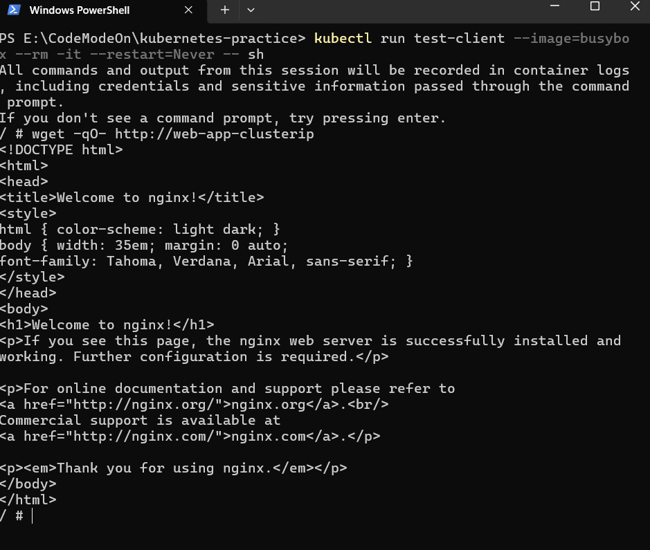
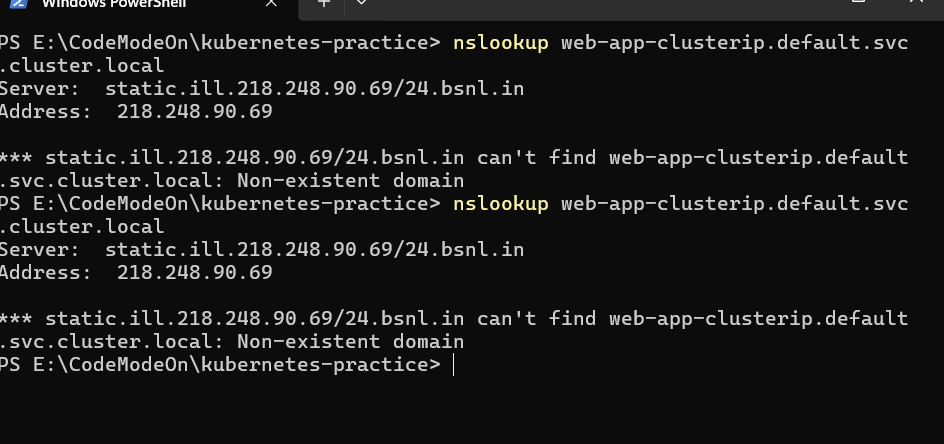
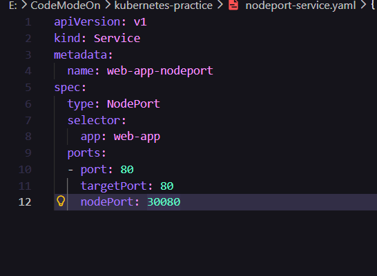
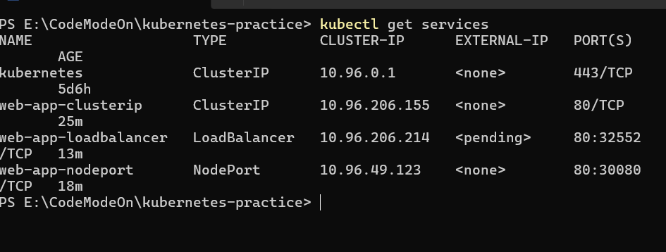
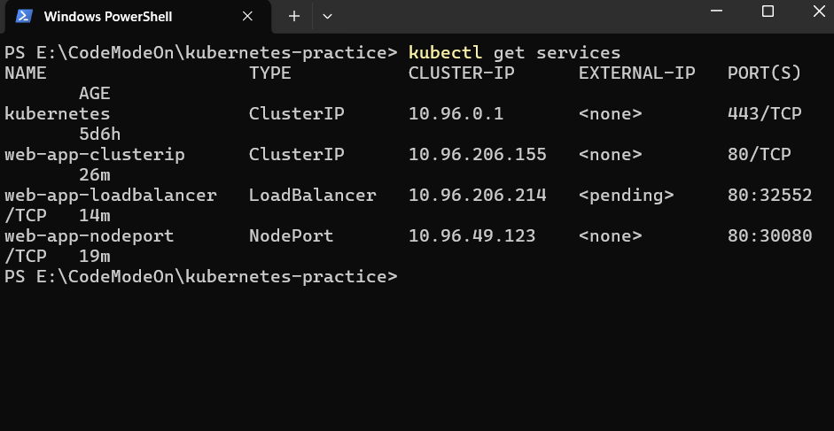
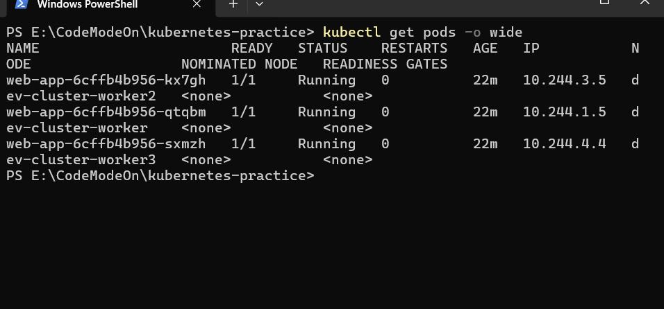

# Day 53 – Kubernetes Services

## Overview

This exercise focuses on understanding Kubernetes Services and how they provide stable networking and load balancing for Pods managed by Deployments.

---

## Problem Statement

Pods in Kubernetes have dynamic IP addresses:

* IPs change when Pods restart
* Multiple Pods exist in a Deployment

This makes direct communication unreliable.

**Solution:** Kubernetes Services provide a stable endpoint and distribute traffic across Pods.

---

## Deployment

```yaml
# app-deployment.yaml
apiVersion: apps/v1
kind: Deployment
metadata:
  name: web-app
  labels:
    app: web-app
spec:
  replicas: 3
  selector:
    matchLabels:
      app: web-app
  template:
    metadata:
      labels:
        app: web-app
    spec:
      containers:
      - name: nginx
        image: nginx:1.25
        ports:
        - containerPort: 80
```

* Created a Deployment with 3 replicas
* Verified Pods with unique IP addresses

---

## Service Types Implemented

### 1. ClusterIP (Default)

```yaml
# clusterip-service.yaml
apiVersion: v1
kind: Service
metadata:
  name: web-app-clusterip
spec:
  type: ClusterIP
  selector:
    app: web-app
  ports:
  - port: 80
    targetPort: 80
```

* Provides internal communication within the cluster
* Accessible via DNS name
* Verified using a temporary BusyBox pod


task 1





---

### 2. NodePort

```yaml
# nodeport-service.yaml
apiVersion: v1
kind: Service
metadata:
  name: web-app-nodeport
spec:
  type: NodePort
  selector:
    app: web-app
  ports:
  - port: 80
    targetPort: 80
    nodePort: 30080
```


* Exposes service on `<NodeIP>:<NodePort>`
* Used for development/testing
* Access achieved using `kubectl port-forward` due to Kind environment


---


### 3. LoadBalancer

```yaml
# loadbalancer-service.yaml
apiVersion: v1
kind: Service
metadata:
  name: web-app-loadbalancer
spec:
  type: LoadBalancer
  selector:
    app: web-app
  ports:
  - port: 80
    targetPort: 80
```


* Intended for cloud environments
* EXTERNAL-IP remains `<pending>` in local clusters
* Internally creates ClusterIP and NodePort

---

## DNS-Based Service Discovery

Kubernetes automatically creates DNS entries:

```
<service-name>.<namespace>.svc.cluster.local
```

Example:

* web-app-clusterip
* web-app-clusterip.default.svc.cluster.local

Verified using:

```bash
nslookup web-app-clusterip
```

---

## Endpoints

Endpoints represent the actual Pod IPs behind a Service.

Check using:

```bash
kubectl get endpoints web-app-clusterip
```

---

## Service Comparison

| Type         | Accessibility         | Use Case            |
| ------------ | --------------------- | ------------------- |
| ClusterIP    | Internal only         | Service-to-service  |
| NodePort     | External via node     | Development/testing |
| LoadBalancer | External via cloud LB | Production          |

---

## Observations

* Services provide stable access despite dynamic Pod IPs
* Traffic is load-balanced across all matching Pods
* DNS simplifies service communication
* NodePort behavior depends on cluster networking
* LoadBalancer requires a cloud provider

---

## Output

```bash
kubectl get services
```



---

## Conclusion

Kubernetes Services enable reliable communication between components by abstracting Pod networking and providing load balancing. Understanding service types is essential for exposing applications in different environments.

---
### All the screenshots are attached in respective sections 


